# Java

## Java基础

### Java和C++的区别

Java 和 C++ 都是面向对象的语言，都支持封装、继承和多态

- Java 不提供指针来直接访问内存，程序内存更加安全
- Java 的类是单继承的，C++ 支持多重继承
- Java 有自动内存管理垃圾回收机制(GC)
- Java是边解释边运行（解释字节码），C++是纯编译型语言，在编译时就直接生成了机器码

### Java基础数据类型及其大小?（byte short int long float double char boolean）

1. byte：占用1字节，也就是8位，它的取值范围是-128到127。
2. short：占用2字节，即16位，可以表示的数值范围是-32768到327673
3. int：占用4字节，32位，能表示的数值范围是从负的2的31次方到正的2的31次方减1
4. long：占用8字节，64位，数据范围为负的2的63次方到正的2的63次方减1
5. float：占用4字节，32位，可以表示的数据范围在3.4e-45到1.4e38之间
6. double：占用8字节，64位，数据范围在4.9e-324到1.8e308之间
7. char：占用2字节，16位，用于存储Unicode码，可以表示一个字符
8. boolean：它只有两个取值，true和false，其大小没有明确的规定

### 基本数据类型和包装数据类型的区别

**用途**：除了定义一些常量和局部变量之外，我们在其他地方比如方法参数、对象属性中很少会使用基本类型来定义变量。并且，包装类型可用于**泛型**，而基本类型不可以。

**存储方式**：基本数据类型的局部变量存放在 Java 虚拟机栈帧中的局部变量表中，基本数据类型的成员变量（未被 `static` 修饰 ）存放在 Java 虚拟机的堆中。包装类型属于对象类型，我们知道几乎所有对象实例都存在于堆中。

**占用空间**：相比于包装类型（对象类型）， 基本数据类型占用的空间往往非常小。

**默认值**：成员变量包装类型不赋值就是 `null` ，而基本类型有默认值且不是 `null`。

**比较方式**：对于基本数据类型来说，`==` 比较的是值。对于包装数据类型来说，`==` 比较的是对象的内存地址。所有整型包装类对象之间值的比较，全部使用 `equals()` 方法。

### 包装类型的缓存机制

`Byte`,`Short`,`Integer`,`Long` 这 4 种包装类默认创建了数值 **[-128，127]** 的相应类型的缓存数据，`Character` 创建了数值在 **[0,127]** 范围的缓存数据，`Boolean` 直接返回 `True` or `False`。

**注意：Float和Double两种浮点型类型的包装类没有实现缓存机制**

### 自动装箱与拆箱

从字节码中，我们发现装箱其实就是调用了 包装类的`valueOf()`方法，拆箱其实就是调用了 `xxxValue()`方法。

- `Integer i = 10` 等价于 `Integer i = Integer.valueOf(10)`
- `int n = i` 等价于 `int n = i.intValue()`;

### 重载和重写的区别

重载就是**同样的一个方法**能够根据输入数据的不同，做出不同的处理

发生在同一个类中（或者父类和子类之间），方法名必须相同，参数类型不同、个数不同、顺序不同，方法返回值和访问修饰符可以不同

重写就是当**子类继承自父类**的相同方法，输入数据一样，但要做出有别于父类的响应时，你就要覆盖父类方法

方法名、参数列表必须相同

### 面向对象和面向过程的区别

- 面向过程把解决问题的过程拆成一个个**方法**，通过一个个方法的执行解决问题
- 面向对象会先抽象出**对象**，然后用对象执行方法的方式解决问题

### 面向对象三大特征（封装、继承、多态)

**封装**：将数据和操作数据的方法组合在一起，并隐藏内部实现细节，仅暴露必要的接口。这样可以保护数据的完整性和提供清晰的接口。

**继承**：允许一个类继承另一个类的属性和方法，从而实现代码的重用和扩展。子类可以继承父类的功能，并可以扩展或修改这些功能。

**多态**：表示一个**对象具有多种的状态**，具体表现为父类的引用指向子类的实例。编译时类型由声明该变量时使用的类型决定。运行时类型由实际赋给该变量的对象决定。如果**编译时类型**和**运行时类型**不一致，就可能出现所谓的多态。

父类 对象名称=new 子类（）；

### 引用拷贝、浅拷贝、深拷贝


浅拷贝。浅拷贝是指仅仅**复制对象的引用**，而不是对象本身，地址是指向同一个地址。换句话说，新旧对象还是**共享同一块内存**。在浅拷贝中，如果原对象内部的子对象发生变化，这种变化也会反映到拷贝对象中，因为两者引用的是同一个子对象。实现浅拷贝，我们需要**实现Cloneable接口并重写Object类中的clone()方法**，如果没有重写clone()方法，则会直接调用Object的clone()方法，而Object的clone()方法是一个受保护的方法，不能直接调用。一般来说，程序默认使用的都是**浅拷贝**

深拷贝。与浅拷贝不同，深拷贝会将对象完整地拷贝出来，开辟新的内存来存放新对象，新对象与原对象完全独立，**不共享内存**，修改新对象不会影响到原对象，反之亦然。在深拷贝中，对于对象中的每一个字段，如果字段是值类型，那么对该字段执行逐位复制；如果字段是引用类型，则递归地复制该字段所引用的对象。要注意的是，实现深拷贝可能需要考虑的问题更多，比如需要避免**循环引用**的问题，否则可能会导致无限递归。用 `Serializable` 接口和 `ObjectOutputStream`、`ObjectInputStream` 可以实现深拷贝

 ```java
node1.next = node2;
node2.next = node1; 
//循环引用
 ```

### Object类中常见方法

`Object` 类提供了以下常用方法：

1. **`toString()`**：返回对象的字符串表示，通常需要重写以提供有意义的描述。
2. **`equals(Object obj)`**：比较当前对象与指定对象是否相等，通常需要重写以实现内容比较。
3. **`hashCode()`**：返回对象的哈希码值，通常与 `equals` 一起重写，以保证一致性。
4. **`getClass()`**：返回对象的运行时类。
5. **`clone()`**：创建对象的副本，类需实现 `Cloneable` 接口并重写此方法。
6. **`notify()`**：唤醒在当前对象上等待的单个线程。
7. **`notifyAll()`**：唤醒在当前对象上等待的所有线程。
8. **`wait()`**：使当前线程等待，直到其他线程调用 `notify()` 或 `notifyAll()`。
9. **`finalize()`**：在对象被垃圾回收前调用，用于资源清理，但不推荐使用。

### equals() 和 == 的区别

**`==`** 对于基本类型和引用类型的作用效果是不同的：

- 对于基本数据类型来说，`==` 比较的是**值**。
- 对于引用数据类型来说，`==` 比较的是对象的**内存地址**。

**`equals()`** 不能用于判断基本数据类型的变量，只能用来判断两个对象是否相等，我们一般都认为`equals`是比较值而不是地址，但是实际上没有重写 `equals()`方法和`==`是一样的，还是比较地址，我们使用发现比较的是值是因为`interger`或者`string`已经被重写了

### 为什么重写equals()时必须重写hashCode()方法

因为两个相等的对象的 `hashCode` 值必须是相等。也就是说如果 `equals` 方法判断两个对象是相等的，那这两个对象的 `hashCode` 值也要相等。

如果重写 `equals()` 时没有重写 `hashCode()` 方法的话就可能会导致 `equals` 方法判断是相等的两个对象，`hashCode` 值却不相等。

**总结**：

- `equals` 方法判断两个对象是相等的，那这两个对象的 `hashCode` 值也要相等。
- 两个对象有相同的 `hashCode` 值，他们也不一定是相等的（哈希碰撞）

### String不可变

Java中的String类被设计为不可变的，这意味着一旦一个String对象被创建，它的内容就不能被改变。这种设计提供了很多好处，比如安全性、可预测性和性能优化。String的不可变性主要是通过以下几个方面来实现的：

1. **私有字段**：string类内部使用**私有字符数组**来存储字符串的内容。由于这个字段是私有且被final修饰的，外部代码无法直接访问或修改它，从而保护了字符串内容的安全性。

2. **没有提供修改方法**：String类没有提供任何可以修改其内部状态的方法。例如，没有提供方法来改变字符串中的某个字符或添加/删除字符
3. **返回新的对象**：当对String对象进行操作(如连接、替换等)时，String类会创建一个新的String对象来保存结果，而不是修改原始对象。这样，原始String对象的状态始终保持不变。
4. **final修饰类**：为了防止子类可能通过继承来破坏String的不可变性，Java中的String类被声明为final，这意味着它不能被继承。这样，就没有子类可以重写String类的方法或添加可能破坏不可变性的新方法。

### JDK9对String底层的优化

在 **JDK 9** 中，`String` 的底层实现进行了优化：

- **存储方式**：从 `char[]` 改为 `byte[]`，采用了 **Compact Strings** 技术。字符串现在可以使用 Latin-1 编码（单字节）或 UTF-16 编码（双字节），根据实际字符集选择最节省内存的方式。ASCII字符用Latin-1编码存储，其他字符用UTF-16编码存储
- **原因**：
  - **内存效率**：减少了内存使用，特别是对主要包含 ASCII 字符的字符串。
  - **性能优化**：减少了内存消耗，提高了性能，特别是在处理大量字符串时。

### String、StringBuilder、StringBuffer的区别？以及字符串拼接怎么使用

`String` 中的对象是不可变的，也就可以理解为常量，线程安全。`AbstractStringBuilder` 是 `StringBuilder` 与 `StringBuffer` 的公共父类，定义了一些字符串的基本操作，如 `expandCapacity`、`append`、`insert`、`indexOf` 等公共方法。`StringBuffer` 对方法加了同步锁或者对调用的方法加了同步锁，所以是线程安全的。`StringBuilder` 并没有对方法进行加同步锁，所以是非线程安全的。

**性能**

每次对 `String` 类型进行改变的时候，都会生成一个新的 `String` 对象，然后将指针指向新的 `String` 对象。`StringBuffer` 每次都会对 `StringBuffer` 对象本身进行操作，而不是生成新的对象并改变对象引用。相同情况下使用 `StringBuilder` 相比使用 `StringBuffer` 仅能获得 10%~15% 左右的性能提升，但却要冒多线程不安全的风险。

**对于三者使用的总结：**

- 操作少量的数据: 适用 `String`
- 单线程操作字符串缓冲区下操作大量数据: 适用 `StringBuilder`
- 多线程操作字符串缓冲区下操作大量数据: 适用 `StringBuffer`

### Java中的异常(Throwable、Exception 和 Error)、异常处理的方式


首先，我们来看看Java异常的分类。在Java中，所有的异常类都继承自 Throwable 类。**Throwable** 类有两个主要的子类：**Error和Exception**。

1. Error：
   Error 类表示严重问题，通常是JVM无法或不应该尝试处理的问题，例如 Java 虚拟机运行错误（`Virtual MachineError`）、虚拟机内存不够错误(`OutOfMemoryError`)、类定义错误（`NoClassDefFoundError`）等 。这些异常发生时，Java 虚拟机（JVM）一般会选择线程终止。
2. Exception：
   Exception 类是程序需要处理的异常情况。它又分为两大类：

  - **检查型异常**(Checked Exceptions)和**非检查型异常**(Unchecked Exceptions)。
  - 检查型异常：这类异常在编译时必须被处理，要么通过 try-catch 块捕获，要么在方法签名中声明抛出，要不就**无法通过编译**。例如，IOException、FileNotFoundException、classNotFoundException等
  - 非检查型异常：这类异常是运行时异常，继承自 RuntimeException 类。它们通常是由程序错误导致的，如空指针访问、数组越界等。常见的运行时异常有 NullPointerException、ArrayIndex0utOfBoundsException、ArithmeticException 等。运行时异常不需要在方法签名中声明，也应该尽量避免。

Java异常的处理方式

- try-catch块：使用 try 块包含可能引发异常的代码，并使用catch 块捕获并处理这些异常。可以在 catch 块中执行特定的错误处理逻辑，如记录日志、回滚事务或执行清理操作。
- finally块：finally 块包含的代码无论是否发生异常都会被执行，通常用于执行清理操作，如关闭文件流或数据库连接
- throw关键字：Java允许程序员**显式**地抛出一个异常，使用 throw 关键字后跟一个异常对象。这通常用于在特定条件下触发异常处理流程。
- throws关键字：在**方法签名**中使用 throws 关键字可以声明该方法可能抛出的异常类型，从而告知调用者需要处理这些异常。

处理异常时还需要注意以下几点：

1. 尽量避免使用空的 catch 块，因为它会吞异常，使得问题难以追踪和调试。
2. 在处理异常时，尽量提供有用的错误信息和堆栈跟踪，以便更好地定位问题。
3. 合理规划异常处理策略，避免过多的嵌套和复杂的逻辑结构。

### 异常的抛出机制

异常通过`throw`关键字抛出，并**沿着调用栈传播**，直到找到合适的`catch`块处理。

当异常在方法中抛出而没有被捕获时，异常会沿着调用栈向上传播，直到找到合适的`catch`块或者最终被JVM捕获并终止程序。

### 为什么不推荐捕获Error

**不可恢复**：`Error`通常表示JVM本身的严重问题，如内存不足或系统资源耗尽。捕获这些错误无法让程序恢复正常运行。

**隐藏问题**：捕获`Error`可能会隐藏问题，使得程序继续运行但处于不稳定或不可预期的状态。

**复杂性**：处理这些严重错误需要深入理解底层平台和环境，而不是简单的应用程序级别的处理。

### OOM属于什么类的异常？为什么会出现OOM，导致OOM的原因

`OutOfMemoryError`是`Error`的子类，表示**JVM内存耗尽**，无法分配更多的对象。

`OutOfMemoryError`的异常堆栈信息会显示导致OOM的代码路径。这有助于调试和优化代码，防止类似问题再次发生

内存泄漏是指程序中分配的内存没有被正确释放，导致内存占用不断增加，最终耗尽可用内存：

- **未关闭资源**：如数据库连接、文件输入输出流、网络连接等未关闭。

- **短时间内创建了过多对象**，超出了JVM堆内存的处理能力：

- **大数据处理**：一次性加载或处理大量数据到内存中。

数据结构持续增长且没有有效的限制机制：

- **无限制的集合增长**：如`ArrayList`、`HashMap`等集合类无限制地添加元素。

### 异常Exception和错误Error相同点?

**继承关系**：两者都继承自`Throwable`类。

**可以抛出和捕获**：可以使用`throw`关键字抛出，并在`try-catch`块中捕获。

**用于错误处理**：都用于处理程序中的错误和异常情况。

### jdk8新特性

1. Lambda 表达式
2. Stream API 
3. 函数式接口

**`Consumer<T>`**：接受一个输入参数并执行操作，无返回值。方法：`void accept(T t)`

**`Supplier<T>`**：提供一个结果，无输入参数。方法：`T get()`

**`Function<T, R>`**：接受一个输入参数，返回一个结果。方法：`R apply(T t)`

**`Predicate<T>`**：接受一个输入参数，返回布尔值用于测试条件。方法：`boolean test(T t)`

**`UnaryOperator<T>`**：接受一个参数，返回相同类型的结果。方法：`T apply(T t)`

**`BinaryOperator<T>`**：接受两个相同类型的参数，返回一个结果。方法：`T apply(T t1, T t2)`

### Java中的Stream流操作

Stream 可以用于对集合进行各种操作，例如过滤、映射、排序、聚合等

`filter`：过滤元素

```java
Stream<String> stream = Stream.of("a", "b", "c", "d");
stream = stream.filter(s -> s.startsWith("a"));
```

`map`：映射元素

```java
stream = stream.map(String::toUpperCase);
```

`sorted`：排序

```java
stream = stream.sorted();
```

`limit`：限制结果数量

```java
stream = stream.limit(2); // 只保留前两个元素
```

`skip`：跳过前几个元素

```java
stream = stream.skip(2); // 跳过前两个元素
```

`forEach`：遍历元素

```java
stream.forEach(System.out::println);
```

### java是值传递还是引用传递（值传递)

Java 中的参数传递机制是**值传递**

- **值传递**：方法接收的是实参值的拷贝，会创建副本。
- **引用传递**：方法接收的直接是实参所引用的对象在堆中的地址，不会创建副本，对形参的修改将影响到实参。

### 设计模式（工厂模式、单例模式、适配器模式、装饰器模式、代理模式)

**工厂模式**

定义一个创建对象的抽象方法，由子类决定要实例化的类。用于创建不同类型对象

定义了一个接口用于创建相关或有依赖关系的对象族，而无需明确指定具体类

**单例模式**

确保一个类最多只有一个实例，并提供一个全局访问点

**适配器模式**

适配器模式将某个类的接口转换成客户端期望的另一个接口表示，目的是消除由于接口不匹配所造成的类的兼容性问题

**装饰器模式**

动态的将新功能附加到对象上。在对象功能扩展方面，它比继承更有弹性

**代理模式**

代理模式给某一个对象提供一个代理对象，并由代理对象控制对原对象的引用。通俗的来讲代理模式就是我们生活中常见的中介

### 详细说一下单例模式

**确保一个类只有一个实例**，并提供一个全局访问点来访问这个实例。单例模式适用于那些需要频繁访问的类，例如**数据库连接池、日志管理器、线程池**等

**饿汉式单例**：在**类加载时就创建实例**，**线程安全**，但如果实例占用资源大且不常用，会造成资源浪费

**懒汉式单例：**在**第一次使用**时才创建实例，但它不是线程安全的，多线程环境下可能会创建多个实例。

**双重检查锁定**：是一种优化的单例模式实现方法，用于在**多线程环境**下，确保只创建一个实例，同时避免每次访问实例时都加锁带来的性能开销

​	**第一次检查**：在进入同步代码块之前，检查实例是否已经初始化。如果已经初始化，直接返回实例，避免不必要的加锁操作。

​	**加锁**：如果第一次检查发现实例尚未创建，进入同步代码块，进行线程同步，以确保只有一个线程能够创建实例。

​	**第二次检查**：在加锁之后，再次检查实例是否已被初始化（因为其他线程可能已经在这个时刻创建了实例）。如果实例仍然未被创建，才真正进行实例化。

​	**返回实例**：实例化完成后，返回单例实例。

注意一定要用`volatile`来保证可见性

```java
public class Singleton {

    private volatile static Singleton uniqueInstance;//使用volatile关键字确保可见性和禁止指令重排序

    private Singleton(){
    }

    public static Singleton getUniqueInstance(){
        if(uniqueInstance == null){//第一次判断，如果instance不为null,不进入抢锁阶段，直接返回实例
            synchronized (Singleton.class){
                if(uniqueInstance == null){//抢到锁之后再次判断是否为null
                    uniqueInstance = new Singleton();
                }
            }
        }
        return uniqueInstance;
    }

}
```


## Java集合


# SSM

## Spring

 ### Spring当中用到的设计模式

**工厂设计模式** : Spring 使用工厂模式通过 `BeanFactory`、`ApplicationContext` 创建 bean 对象。

**代理设计模式** : Spring AOP 功能的实现。

**单例设计模式** : Spring 中的 Bean 默认都是单例的。

**模板方法模式** : Spring 中 `jdbcTemplate`、`hibernateTemplate` 等以 Template 结尾的对数据库操作的类，它们就使用到了模板模式。

**装饰器模式** : 我们的项目需要连接多个数据库，而且不同的客户在每次访问中根据需要会去访问不同的数据库。这种模式让我们可以根据客户的需求能够动态切换不同的数据源。

**观察者模式:** Spring 事件驱动模型就是观察者模式很经典的一个应用。

**适配器模式** : Spring AOP 的增强或通知(Advice)使用到了适配器模式、spring MVC 中也是用到了适配器模式适配`Controller`。

### 介绍一下Spring IOC

Spring的IOC，也就是控制反转，是Spring框架的核心特性之一。要理解IOC，我们首先需要了解两个概念：**控制反转和依赖注入**。

控制反转，即Inversion of Control，简称IoC。它的主要思想是将原本由代码直接操控的对象的调用权交给第三方，比如一个容器来控制，以解耦代码。在传统的程序设计中，我们直接在对象内部通过 new 关键字来创建依赖的对象，这种方式会导致代码之间高度耦合，不利于测试和维护。而IoC的思想是，将这些对象创建和绑定的控制权交由Spring容器来管理，从而降低系统的耦合性。在 Spring 中， IoC 容器是 Spring 用来实现 IoC 的载体， IoC 容器实际上就是个 Map（key，value），Map 中存放的是各种对象。

具体来说，在Spring中实现IoC主要有两种方式：基于XML的配置和基于注解的配置。在XML配置中，我们可以在Spring的配置文件中，通过bean元素来定义需要Spring管理的对象，并通过property元素来注入依赖。而在注解配置中，可以使用如`@Autowired`、`@Resource`等注解来自动注入依赖。

Spring loC容器负责管理Bean的生命周期、依赖注入等。我们只需要配置好相关Bean就可以轻松实现对象之间的解耦和依赖管理。总的来说，IoC的思想和Spring的IoC容器极大地提高了代码的灵活性和可维护性，降低了系统的复杂度

另外，Spring IoC还提供了很多高级特性，如Bean的作用域控制、生命周期回调、事件传播等，这些特性可以帮助我们更好地管理和控制Bean的行为。

总的来说，我对Spring IoC的理解是，它是一种强大的解耦和管理对象依赖关系的工具通过把对象的创建和依赖关系的控制权交给Spring容器来管理，从而提高了代码的灵活性和可维护性。

### 让你设计Spring IOC，你会怎么考虑

Bean的生命周期管理:需要设计Bean的创建、初始化、销毁等生命周期管理机制，可以考虑使用工厂模式和单例模式来实现。

依赖注入:需要实现依赖注入的功能，包括属性注入、构造函数注入、方法注入等，可以考虑使用反射机制和XML配置文件来实现。

Bean的作用域:需要支持多种Bean作用域，比如单例、原型、会话、请求等，可以考虑使用Map来存储不同作用域的Bean实例。

AOP功能的支持:需要支持AOP功能，可以考虑使用动态代理机制和切面编程来实现。

异常处理:需要考虑异常处理机制，包括Bean创建异常、依赖注入异常等，可以考虑使用try-catch机制来处理异常。

配置文件加载:需要支持从不同的配置文件中加载Bean的相关信息，可以考虑使用XML、注解或者Java配置类来实现。

-------------------------------------------------------------------------------------------------------------------------

1. 找到bean在什么地方，是对BeanDefinition的资源定位，是由ResourceLoader通过统一的Resource接口来完成，这个接口对各中形式的Resource都提供了统一接口，比如Xml，比如annotation。而这些都是由ResourceLoader来完成的

   **扫描这个项目，将所有类的文件名.class存在链表classNames中**

2. 载入并注册bean

   找到bean后，将bean注册到我们的IOC容器中。Spring是通过一些ApplicationContext来完成的，比如FileSystemXmlApplicationContext, ClassPathXmlApplicationContext以及我们最常见的XmlWebApplicationContext，读取之后将bean注册到IOC容器中，简单来说，就是把读取的bean都放到一个map中。

   然后根据classNames中的文件名反射得到@Controller和@Service 所注释的类的Class对象，然后将对象放入了instanceMap中，这些Class对象所对应的key就是@注释中的值。其实说白了就是就是将Controller层和Service层中的类的Class对象存在了在Map中，然后用@注释名来当Map的key

3. 注入bean

   循环遍历出每个instanceMap中Class对象的变量，判断这个变量上面有没有@Qualifer注解，有则拿到@qualifer的注解值，然后通过这个值在instanceMap中对应的Class对象更新（注入）到参数上去。

### IOC注册Bean的方式

注册bean实际上就是告诉IoC容器所管理的对象，有3种， **XML 文件、注解或者 Java 配置类**

**XML 配置**

XML 配置是 Spring 早期版本主要使用的方式

```xml
<!-- beans.xml -->
<!-- Constructor-arg with 'value' attribute -->
<bean id="..." class="...">
   <constructor-arg value="..."/>
</bean>
```

**注解配置**

- `@Component`：通用的注解，可标注任意类为 `Spring` 组件。如果一个 Bean 不知道属于哪个层，可以使用`@Component` 注解标注。

- `@Repository` : 对应持久层即 Dao 层，主要用于数据库相关操作。

- `@Service` : 对应服务层，主要涉及一些复杂的逻辑，需要用到 Dao 层。

- `@Controller` : 对应 Spring MVC 控制层，主要用于接受用户请求并调用 `Service` 层返回数据给前端页面
- `@Autowired`：`@Autowired` 是 Spring 提供的注解，默认的注入方式为`byType`（根据类型进行匹配），可以通过 `@Qualifier` 注解来显式指定名称
- `@Resource`：`@Resource` 是 JDK 提供的注解，`@Resource`默认注入方式为 `byName`（根据名称进行匹配），可以通过 `name` 属性来显式指定名称。
- `@Inject`

**Java配置类**

Java 配置类是使用 Java 代码来进行配置

使用 `@Configuration` 和 `@Bean` 注解来定义和配置 Bean

**@Bean**：是用于在方法级别上定义 Bean。通常和 `@Configuration` 配合使用。`@Bean` 注解的方法返回的对象会被注册为 Spring 容器中的一个 Bean。

**@Component**：是类级别的注解，用于标记一个类为 Spring 容器中的 Bean。Spring 会通过类路径扫描自动发现带有 `@Component` 注解的类，并将它们注册为容器中的 Bean

### IOC的实现机制

1.反射:Spring IOC容器利用Java的反射机制动态地加载类、创建对象实例及调用对象方法，反射允许在运行时检查类、方法、属性等信息，从而实现灵活的对象实例化和管理。

2.依赖注入:IOC的核心概念是依赖注入，即容器负责管理应用程序组件之间的依赖关系。Spring通过构造函数注入、属性注入或方法注入，将组件之间的依赖关系描述在配置文件中或使用注解。

3.设计模式-工厂模式:Spring IOC容器通常采用工厂模式来管理对象的创建和生命周期。容器作为工厂负责实例化Bean并管理它们的生命周期，将Bean的实例化过程交给容器来管理。

4.容器实现:Spring IOC容器是实现IOC的核心，通常使用Beanfactory或ApplicationContext来管理Bean。Beanfactory是IOC容器的基本形式，提供基本的IOC功能;ApplicationContext是Beanfactory的扩展，并提供更多企业级功能。

### 介绍一下Spring AOP(连接点、目标对象、通知、代理、切入点)

AOP就是**面向切面编程**，它可以理解为一种思想，Spring AOP是一种常见的AOP实现，它是Spring框架中的一个重要内容，也是OOP(面向对象编程)的一种延续。与OOP关注对象不同AOP关注的是在程序运行中的某个切入点进行特定的操作，比如日志记录、事务管理等

关于Spring AOP，我认为可以从以下几个方面来理解：

一、**AOP的作用和优势**

AOP的主要作用是在不修改源代码的情况下，对方法进行功能增强。这使得我们可以在不改变原有业务逻辑的基础上，动态地添加一些额外的功能，如日志记录、性能监控等。其优势主要体现在减少重复代码，提高开发效率，同时便于后期维护。

二、**AOP的关键概念**

在AOP中，有几个关键的概念需要理解。首先是连接点(Joinpoint)，指程序执行过程中的一个点，例如方法调用、异常处理等。在 Spring AOP 中仅支持方法级别的连接点。其次是目标(Target)，即被通知或被代理的对象，它完成具体的业务逻辑。通知(Advice)是在某个特定的连接点上执行的动作，它包含了具体的程序代码实现。代理(Proxy)是将通知应用到目标对象后创建的对象，它结合了目标和通知的功能。最后是切入点(Pointcut)，它定义了通知应该应用到哪些连接点。

三、**AOP的实现方式**

在Spring中，AOP的实现主要依赖于动态代理技术。Spring提供了两种动态代理技术：JDK代理和CGLIB代理。JDK代理是基于接口的动态代理技术，它要求目标对象必须实现一个接口。而CGLIB代理是基于父类的动态代理技术，它可以对没有实现接口的目标对象进行代理。在运行时，Spring会根据目标对象的情况自动选择使用哪种代理技术。

四、**AOP的适用场景**

Spring AOP广泛应用于日志记录、事务管理、安全性检査、性能监控、异常处理、缓存管理以及参数校验等场景。这些场景中的功能都可以通过AOP在不修改原有业务逻辑的情况下动态添加进来。

总的来说，Spring AOP提供了一种灵活且强大的方式来增强程序的功能，同时降低了代码的耦合度，提高了程序的可重用性和开发效率。在实际开发中，我们应该根据具体的业务需求和系统架构来合理利用Spring AOP的功能。

### AOP中动态代理怎么实现，动态代理怎么实现(JDK动态代理、CGLIB动态代理)

动态代理是 Java 中的一种设计模式，允许在运行时创建代理类，代理类能够动态地拦截和处理方法调用。Java 中有两种主要的动态代理机制：

1. **JDK** 动态代理：通过调用`Proxy.newProxyInstance(ClassLoader, Class, InvocationHandler)` 会在运行时生成一个代理类，该类实现了目标类实现的所有接口且继承于Proxy类，并且其方法调用被转发到 `InvocationHandler` 的 `invoke` 方法。

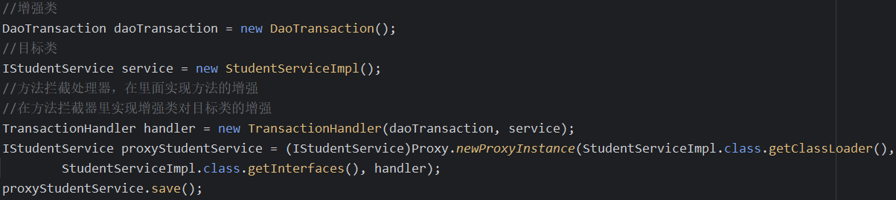

2.**CGLIB** 动态代理：代理类通过继承目标类并重写其方法来实现代理。通过方法拦截器 `MethodInterceptor` 实现方法增强，使用 `Enhancer` 类创建代理对象。

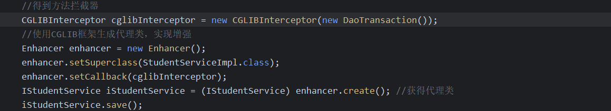

**AOP动态代理**

Spring AOP 根据目标对象实现了一个或多个接口，会使用JDK动态代理，否则使用CGLIB动态代理

1. **JDK 动态代理**：
   - Spring 使用 `ProxyFactory` 和 `JdkDynamicAopProxy` 创建代理对象。
   - 代理对象调用方法时，通过 `JdkDynamicAopProxy` 的 `invoke` 方法将调用委托给 `AdvisedSupport`，处理所有的拦截器和通知。
2. **CGLIB 动态代理**：
   - Spring 使用 `CglibAopProxy` 创建代理对象。
   - 代理对象调用方法时，通过 `CglibAopProxy` 的 `intercept` 方法将调用委托给 `AdvisedSupport`，处理所有的拦截器和通知。

### AOP有哪些注解

@Aspect:用于定义切面，标注在切面类上。
@Pointcut:定义切点，标注在方法上，用于指定连接点。
@Before:在方法执行之前执行通知。
@After:在方法执行之后执行通知。
@Around:在方法执行前后都执行通知。
@AfterReturning:在方法执行后返回结果后执行通知。
@AfterThrowing:在方法抛出异常后执行通知。
@Advice:通用的通知类型，可以替代@Before、@After等。

### Spring的事务介绍一下，以及事务的底层原理

Spring 支持两种方式的事务管理

**1.编程式事务**：在代码中硬编码(在分布式系统中推荐使用) : 通过 `TransactionTemplate`或者 `TransactionManager` 手动管理事务，事务范围过大会出现事务未提交导致超时，因此事务要比锁的粒度更小。

**2.声明式事务**：在 XML 配置文件中配置或者直接基于注解（单体应用或者简单业务系统推荐使用） : 实际是通过 AOP 实现（基于`@Transactional` 的全注解方式使用最多）

**事务的底层原理**

**事务管理器**：**`PlatformTransactionManager`**负责处理事务的提交、回滚等操作

**事务属性**：在声明式事务管理中，事务属性定义了事务的行为，包括传播行为、隔离级别、回滚规则、事务超时、是否只读等

**事务状态**: 事务状态用来获取或判断事务的相应状态信息。

### Spring事务注解@Transactional失效的场景

1.未捕获异常: 如果一个事务方法中发生了未捕获的异常，并且异常未被处理或传播到事务边界之外，那么事务会失效，所有的数据库操作会回滚。

2.非受检异常: 默认情况下，Spring对非受检异常(RuntimeException或其子类)进行回滚处理，这意味着当事务方法中抛出这些异常时，事务会回滚

3.事务传播属性设置不当: 如果在多个事务之间存在事务嵌套，且事务传播属性配置不正确，可能导致事务失效。特别是在方法内部调用有 @Transactional 注解的方法时要特别注意

4.多数据源的事务管理: 如果在使用多数据源时，事务管理没有正确配置或者存在多个 @Transactional 注解时，可能会导致事务失效。

5.跨方法调用事务问题: 如果一个事务方法内部调用另一个方法，而这个被调用的方法没有@Transactional 注解，这种情况下外层事务可能会失效。

6.事务在非公开方法中失效: 如果 @Transactional 注解标注在私有方法上或者非 public方法上，事务也会失效。

### Spring事务的传播行为

Spring事务的传播行为（Transaction Propagation）定义了事务方法如何与现有事务协作。主要有以下几种传播类型：

1. **REQUIRED**（默认）：如果当前存在事务，则加入该事务；如果当前没有事务，则创建一个新的事务。
2. **REQUIRES_NEW**：创建一个新的事务，如果当前存在事务，则把当前事务挂起。
3. **SUPPORTS**：如果当前存在事务，则加入该事务；如果当前没有事务，则以非事务的方式继续运行。
4. **NOT_SUPPORTED**：以非事务方式运行，如果当前存在事务，则把当前事务挂起。
5. **MANDATORY**：如果当前存在事务，则加入该事务；如果当前没有事务，则抛出异常。
6. **NEVER**：以以非事务方式运行，如果当前存在事务，则抛出异常
7. **NESTED**：如果当前存在事务，则创建一个事务作为当前事务的嵌套事务来运行；如果当前没有事务，则创建一个新的事务。

### Bean的作用域

- **singleton** : IoC 容器中只有唯一的 bean 实例。Spring 中的 **bean 默认都是单例的**，是对单例设计模式的应用。
- **prototype** : 每次获取都会创建一个新的 bean 实例。也就是说，连续 `getBean()` 两次，得到的是不同的 Bean 实例。
- **request** （仅 Web 应用可用）: 每一次 HTTP 请求都会产生一个新的 bean（请求 bean），该 bean 仅在当前 HTTP request 内有效。
- **session** （仅 Web 应用可用） : 每一次来自新 session 的 HTTP 请求都会产生一个新的 bean（会话 bean），该 bean 仅在当前 HTTP session 内有效。
- **application/global-session** （仅 Web 应用可用）：每个 Web 应用在启动时创建一个 Bean（应用 Bean），该 bean 仅在当前应用启动时间内有效。
- **websocket** （仅 Web 应用可用）：每一次 WebSocket 会话产生一个新的 bean。

### Bean的生命周期

简化版：(实例化 → 依赖注入 → 初始化 → 销毁)

1.**实例化**：Bean 容器首先会找到配置文件中的 Bean 定义，然后使用 Java 反射 API 来创建 Bean 的实例。

2.**依赖注入**：为 Bean 设置相关属性和依赖，例如`@Autowired` 等注解注入的对象、`@Value` 注入的值、`setter`方法或构造函数注入依赖和值、`@Resource`注入的各种资源

3.**`postProcessBeforeInitialization()`**：初始化前的自定义逻辑。

4.**初始化**：执行 `afterPropertiesSet()` 或自定义初始化方法。

5.**`postProcessAfterInitialization()`**：初始化后的自定义逻辑。

6.**销毁**：执行 `destroy()` 或自定义销毁方法。

----------------------------------------------------------------------------------------------------------------------------

复杂版：

Spring Bean的生命周期大体上可以分为四个阶段：实例化、属性赋值、初始化、销毁

**实例化阶段：**

这个阶段主要是通过反射技术创建Bean的实例。Spring会根据配置文件中Bean的定义利用`Java Reflection`（反射）技术创建对应的实例。

**属性赋值阶段：**

实例化后的对象被封装在`BeanWrapper`对象中，此时对象仍然是一个原生状态，并没有进行依赖注入。Spring根据`BeanDefinition`中的信息进行依赖注入，通过`populateBean`方法完成属性的注入。此外，如果Bean实现了`xxxAware`接口，Spring会调用相应的set方法注入相应的内容，如`BeanNameAware`、`BeanClassLoaderAware`、`BeanFactoryAware`和`ApplicationContextAware`等

**初始化阶段：**

初始化阶段是Bean生命周期中非常关键的一个环节，它包含了多个扩展点。

1. **执行Aware接口的方法**：如果Bean实现了相应的Aware接口，Spring会调用这些接口定义的方法，如`setBeanName`、`setBeanClassLoader`、`setBeanFactory`和`setApplicationContext`等。
2. **执行`BeanPostProcessor`的前置处理：**如果Bean实现了`BeanPostProcessor`接口，Spring会在初始化方法调用前，先调用其`postProcessBeforeInitialization`方法，这是用户自定义处理逻辑的一个重要扩展点。
3. **执行`InitializingBean`接口的方法**：如果Bean实现了`InitializingBean`接口，Spring会调用其`afterPropertiesSet`方法，用户可以在这个方法中进行一些初始化操作。
4. **执行自定义的`init-method`**：如果在Spring的配置文件中为Bean指定了`init-method`属
   性，Spring会自动调用这个指定的初始化方法。
5. **执行`BeanPostProcessor`的后置处理**：在初始化方法调用后，如果Bean实现了`BeanPostProcessor`接口，Spring还会调用其`postProcessAfterInitialization`方法，这是另一个用户自定义处理逻辑的扩展点。

**销毁阶段：**
当Bean不再需要时，如果Bean实现了`DisposableBean`接口，Spring会调用其`destroy`方法进行销毁前的清理工作。同时，如果在配置文件中指定了`destroy-method`属性，Spring也会在销毁前调用这个方法。

综上所述，Spring Bean的生命周期包括实例化、属性赋值、初始化和销毁四个阶段，其中每个阶段都提供了不同的扩展点，允许用户自定义处理逻辑。这些扩展点增强了Spring框架的灵活性和可扩展性，使得开发者能够更加灵活地控制Bean的生命周期行为。

### Bean的单例和非单例的生命周期

**单例 Bean** 生命周期与容器相同，实例化后会被缓存和重用，容器关闭时销毁。

**非单例 Bean** 每次请求都会生成新实例，不由 Spring 容器管理生命周期和销毁，生命周期较短且仅限于其创建后使用的那一段时间。

### Spring拓展点？比如BeanFactory，init方法这些

Spring 框架提供了许多扩展点，允许开发者在不同的生命周期阶段进行自定义操作。这些扩展点涵盖了 Bean 的创建、初始化、销毁等多个环节。

比如

1. 实现 `InitializingBean` 接口的 Bean 会在其属性设置完毕后调用 `afterPropertiesSet` 方法。可以在该方法中执行一些初始化操作。

2. 实现 `DisposableBean` 接口的 Bean 会在销毁时调用 `destroy` 方法。可以在该方法中执行一些清理操作。

3. 实现 `FactoryBean` 接口的类用于创建复杂的 Bean 实例。可以自定义 Bean 的创建逻辑。

4. 可以使用 `@PostConstruct` 注解在 Bean 初始化完成后执行方法，使用 `@PreDestroy` 注解在 Bean 销毁前执行方法。

### 解决缓存依赖的三级缓存

**一级缓存（singletonObjects）**：存放最终形态的 Bean（已经实例化、属性填充、初始化）。一般情况我们获取 Bean 都是从这里获取的

**二级缓存（earlySingletonObjects）**：存放过渡 Bean（半成品，尚未属性填充），也就是三级缓存中`ObjectFactory`产生的对象，与三级缓存配合使用的，可以防止 AOP 的情况下，每次调用`ObjectFactory#getObject()`都是会产生新的代理对象的。

**三级缓存（singletonFactories）**：存放`ObjectFactory`，`ObjectFactory`的`getObject()`方法（最终调用的是`getEarlyBeanReference()`方法）可以生成原始 Bean 对象或者代理对象

1. 先去 **一级缓存 `singletonObjects`** 中获取，存在就返回；

2. 如果不存在或者对象正在创建中，于是去 **二级缓存 `earlySingletonObjects`** 中获取；

3. 如果还没有获取到，就去 **三级缓存 `singletonFactories`** 中获取，通过执行 `ObjectFacotry` 的 `getObject()` 就可以获取该对象，获取成功之后，从三级缓存移除，并将该对象加入到二级缓存中

Spring容器通过其依赖注入机制来处理循环依赖问题。对于Singleton Bean，Spring容器会先实例化一个Bean，但并不立即进行依赖注入。当发现循环依赖时，Spring会利用一个三级缓存机制来解决这个问题，**三级缓存**其实就是三个 Map。首先，也就是如果发生循环依赖的话，就去 **三级缓存 `singletonFactories`** 中拿到三级缓存中存储的 `ObjectFactory` 并调用它的 `getObject()` 方法来获取这个循环依赖对象的前期暴露对象（虽然还没初始化完成，但是可以拿到该对象在堆中的存储地址了），并且将这个前期暴露对象放到二级缓存中，这样在循环依赖时，就不会重复初始化了！

然而，对于构造函数注入的循环依赖，Spring无法解决，因为这需要在实例化Bean之前满足所有的依赖关系。因此，如果存在构造函数注入的循环依赖，项目在启动时会报错。

### Spring在多线程是如何保证线程安全的？

在 Spring 框架中，单例（`singleton`）作用域的 Bean 在多线程环境中是共享的，因此需要确保线程安全。

1. **创建 Bean 的同步**：Spring 会确保单例 Bean 的实例化是线程安全的。即使多个线程同时请求一个单例 Bean，Spring 也会确保只会有一个线程创建 Bean 实例，其他线程将等待创建完成，并返回同一个实例

2. 在创建和管理单例 Bean 时，Spring 使用同步块来确保创建过程的线程安全

3. 初始化和销毁

   **初始化**：Spring 容器在启动时会初始化所有的单例 Bean。容器的启动过程是线程安全的，确保在所有线程访问之前，所有的单例 Bean 都已经创建和初始化完成。

   **销毁**：在容器关闭时，Spring 会执行销毁回调（如 `@PreDestroy` 注解的方法）来清理单例 Bean 的资源。销毁过程也是线程安全的，确保不会出现并发问题。

## SpringMVC

### SpringMVC的工作流程、工作原理

一、**用户请求与前端控制器的接收**

1. 当用户发送一个请求时，这个请求首先会被SpringMVC的**前端控制器**`DispatcherServlet`捕获
2. `DispatcherServlet`会对请求的**URL进行解析**，获取请求的URI，并根据这个URI来决定后续的处理流程

二、**处理器映射与处理器执行链的获取**

1. DispatcherServlet会将**解析得到的URI发送给**`HandlerMapping`(**处理器映射器**)，由其找到**对应的`Handler`**(控制器中的具体方法)以及相关的拦截器，并将它们封装成一个`HandlerExecutionChain`(处理器执行链)返回。
2. 这个过程中，`HandlerMapping`会根据请求的URL和HTTP方法(如GET、POST等)来查找并匹配对应的Handler。

三、**处理器适配与执行**

1. **前端控制器**在获取到`HandlerExecutionChain`后，会**选择一个合适的`HandlerAdapter`(处理器适配器)来执行这个链中的`Handler`**。
2. **处理器适配器**会提取`Request`中的模型数据，填充`Handler`的入参，并**开始执行`Handler`**。在这个过程中SpringMVC还会进行一系列的数据转换、数据格式化和数据验证等工作。

四、**处理器执行结果与模型视图的返回**

1. **`Handler`执行完毕后，会返回一个`ModelAndView`对象给处理器适配器**。这个对象包含了处理的结果数据(模型)以及要展示的视图名称或视图对象。
2. 处理器适配器接收到`ModelAndView`后，会将其返回给前端控制器

五、**视图解析与渲染**

1. 前端控制器在接收到`ModelAndView`后，会请求对应的`ViewResolver`(**视图解析器**)进行解析。`ViewResolver`会根据`ModelAndView`中指定的视图名称找到对应的`View`(视图)对象，并返回给`DispatcherServlet`
2. 最后，由`View`对象负责将模型数据渲染到视图中，生成最终的响应页面，并返回给客户端用户。

## SpringBoot

### 讲一下SpringBoot自动装配原理

首先，自动装配是指Spring Boot通过分析项目的依赖和配置，自动配置Spring应用程序所需的组件，而开发者无需手动配置大量的XML配置文件或Java代码。这大大简化了Spring应用的开发和配置过程。

那么，Spring Boot是如何实现自动装配的呢?这主要得益于以下几个关键部分：

1. `@SpringBootApplication`注解：这是启动Spring Boot应用的核心注解，它实际上是一个复合注解，包括了`@Configuration`、`@EnableAutoConfiguration`和`@Componentscan`等。其中，`@EnableAutoConfiguration`是实现自动装配的关键。
2. `@EnableAutoConfiguration`注解：这个注解是 Spring Boot 自动装配的核心。它告诉 Springboot 启用自动配置机制，根据项目的依赖和配置自动配置应用程序的上下文。通过这个注解，SpringBoot 将尝试根据类路径上的依赖自动配置应用程序。这个注解内部使用了`@Import(AutoConfigurationImportSelector.class)`，这是实现自动装配的核心类。
3. `AutoConfigurationImportSelecto`r类：这个类负责加载`META-INF/spring.factories`文件中配置的自动装配类。Spring Boot在启动时，会实例化这个类，并加载配置文件中指定的自动装配类。这些类通常包含了一些Bean的定义和配置。
4. 条件装配：Spring Boot的自动装配还支持基于条件的装配。这意味着只有在某些条件满足时，特定的自动装配才会发生。这是通过`@Conditional`注解实现的。例如，如果`classpath`下有某个特定的类库，那么与之相关的自动装配就会被触发。
5. `SpringFactoriesLoader`：这是一个工具类，用于加载`META-INF/spring.factories`文件中的配置。这个文件包含了各种自动装配类的全限定名，供`AutoConfiqurationImportSelector`类加载和使用。

综上所述，Spring Boot的自动装配原理可以归纳为以下几个步骤：

- 通过`@SpringBootApplication`注解启动Spring Boot应用
- `@EnableAutoConfiguration`注解触发自动装配机制
- `AutoConfigurationImportSelector`类加载`META-INF/spring.factories`中配置的自动装配类
- 根据条件装配的规则，决定是否进行特定的自动装配
- 最后，通过`SpringFactoriesLoader`工具类加载并实例化自动装配类中的Bean

### SpringBoot的约定大于配置

1.**自动化配置：**Spring Boot 提供了大量的自动化配置，通过分析项目的依赖和环境，自动配置应用程序的行为。开发者无需显式地配置每个细节，大部分常用的配置都已经预设好了。例如，Spring Boot可以根据项目中引入的数据库依赖自动配置数据源。

2.**默认配置：**Spring Boot 在没有明确配置的情况下，会使用合理的默认值来初始化应用程序。这种默认行为使得开发者可以专注于核心业务逻辑，而无需关心每个细节的配置。

**3.约定优于配置：**Spring Boot 遵循了约定优于配置的设计哲学，即通过约定好的方式来提供默认行为，减少开发者需要做出的决策。例如，约定了项目结构、Bean 命名规范等，使得开发者可以更快地上手并保持团队间的一致性。

**Spring Boot通过「自动化配置」和「起步依赖」实现了约定大于配置的特性。**
1.**自动化配置：**Spring Boot根据项目的依赖和环境自动配置应用程序，无需手动配置大量的XML或Java酊置文件。例如，如果项目引入了Spring Web MVC依赖，Spring Boot会自动配置一个基本的Web应用程序上下文。
2.**起步依赖：**Spring Boot提供了一系列起步依赖，这些依赖包含了常用的框架和功能，可以帮助开发者快速搭建项目。通过引入适合项目需求的起步依赖，开发者可以

### SpringBoot中用到的设计模式

**代理模式：**Spring 的 AOP 通过动态代理实现方法级别的切面增强，有静态和动态两种代理方式，采用动态代理方式。

**策略模式：**Spring AOP 支持 JDK 和 Cglib 两种动态代理实现方式，通过策略接口和不同策略类，运行时动态选择，其创建一般通过工厂方法实现。

**装饰器模式：**Spring 用 TransactionAwareCacheDecorator 解决缓存与数据库事务问题增加对事务的支持。

**单例模式：**Spring Bean 默认是单例模式，通过单例注册表(如 HashMap)实现。

**简单工厂模式：**Spring 中的 Beanfactory 是简单工厂模式的体现，通过工厂类方法获取 Bean 实例。

**工厂方法模式：**Spring中的 FactoryBean 体现工厂方法模式，为不同产品提供不同工厂

**观察者模式：**Spring 观察者模式包含 Event 事件、Listener 监听者、Publisher 发送者，通过定义事件、监听器和发送者实现，观察者注册在 ApplicationContext 中，消息发送由ApplicationEventMulticaster完成。

**模板模式：**Spring Bean 的创建过程涉及模板模式，体现扩展性，类似 Callback 回调实现方式。

**适配器模式：**Spring MVC 中针对不同方式定义的 Controller，利用适配器模式统一函数定义，定义了统一接口 HandlerAdapter 及对应适配器类。

## MyBatis

### Mybatis里的 # 和 $ 的区别

1.Mybatis 在处理 # 时，会创建预编译的 SQL语句，将 SQL 中的 # 替换为?号，在执行 SQL 时会为预编译 SQL 中的占位符(?)赋值，调用 Preparedstatement 的 set 方法来赋值，预编译的 SQL语句执行效率高，并且可以防止SQL注入，提供更高的安全性，适合传递参数值

2.Mybatis 在处理 $ 时，只是创建普通的 SQL语句，然后在执行 SQL语句时 MyBatis 将参数直接拼入到 SQL 里，不能防止 SQL注入，因为参数直接拼接到 SQL语句中，如果参数未经过验证、过滤，可能会导致安全问题，

### MyBatis的设计模式

1. 工厂模式

   在Mybatis中比如`SqlSessionFactory`使用的是工厂模式

2. 单例模式

   在Mybatis中有两个地方用到单例模式，ErrorContext和LogFactory，其中ErrorContext是用在线程范围内的单例，记录该线程的执行环境错误信息，而LogFactory则是提供给整个Mybatis使用的日志工厂，用于获得针对项目配置好的日志对象。

3. 代理模式

   代理模式可以认为是Mybatis的核心使用的模式，正是由于这个模式，我们只需要编写`Mapper.java`接口，不需要实现，由Mybatis后台帮我们完成具体SQL的执行，Mybatis会在解析全局配置文件中的mapper标签时提前帮我们创建好所有mapper接口的代理对象

4. 适配器模式

   将一个接口转换成客户希望的另一个接口，适配器模式使接口不兼容的那些类可以一起工作

   MyBatis通过适配器模式定义了一套统一的日志接口供上层使用，在Mybatsi的logging包中，有一个Log接口，定义了四种日志级别，相比较其他的日志框架的多种日志级别显得非常的精简

5. 装饰器模式

   在mybatis中，缓存的功能由根接口`Cache（org.apache.ibatis.cache.Cache）`定义。整个体系采用装饰器设计模式，通过一系列的装饰器来对`PerpetualCache`永久缓存进行缓存策略等方面的控制

### Mybatis的执行流程

1、获取sqlSessionFactory对象:

解析文件的每一个信息保存在Configuration中，返回包含Configuration的DefaultSqlSession；

注意：【MappedStatement】：代表一个增删改查的详细信息

2、获取sqlSession对象

返回一个DefaultSQlSession对象，包含Executor和Configuration;

这一步会创建Executor对象；

3、获取接口的代理对象（MapperProxy）

getMapper，使用MapperProxyFactory创建一个MapperProxy的代理对象

代理对象里面包含了，DefaultSqlSession（Executor）

4、执行增删改查方法

### JDBC连接数据库步骤

1. 加载JDBC驱动程序

   通过 `Class.forName()` ，加载并注册 JDBC 驱动程序类

2. 建立数据库连接

   使用 `DriverManager.getConnection()` 方法建立与数据库的连接。需要提供数据库的 URL、用户名和密码

3. 创建 Statement  对象

   使用 `Connection` 对象`createStatement()`方法创建 `Statement` 对象

4. 执行 SQL 查询或更新、

   使用 `Statement` 对象执行 SQL 语句

   ```java
   ResultSet resultSet = statement.executeQuery("SELECT * FROM users");
   ```

5. 关闭资源

   使用完数据库连接后，必须关闭 `ResultSet`、`Statement` 和 `Connection` 对象，以释放数据库资源。

#  MySQL

## MySQL基础

### MySQL的存储引擎、InnoDB和MyISAM的区别

1.InnoDB存储引擎:

**事务支持**：InnoDB是事务型数据库的首选引擎，它提供了提交、回滚和崩溃恢复能力来保护用户数据，确保数据的完整性。它遵循ACID原则，即原子性、一致性、隔离性和持久性。

**行级锁定**：InnoDB支持行级锁定，这意味着在多个用户并发访问数据库时，它只会锁定被访问的行，而不是整个表。这大大提高了数据库的并发性能。

**外键约束**：InnoDB还支持外键约束，可以确保数据的参照完整性。

**聚簇索引**：InnoDB使用聚簇索引，即数据和主键索引存储在一起，这有助于提高某些查询的效率。

2.MyISAM存储引擎:

**表级锁定**：MyISAM不支持事务和行级锁定，只支持表级锁。这意味着在读写操作时，会对整个表进行锁定，可能导致并发性能较差。

**全文索引**：MyISAM支持全文索引，适合进行文本搜索。

**高速读取**：MyISAM通常用于只读或大量读取的应用场景，如Web站点的归档数据或只读的数据仓库。其查询速度相对较快，

**压缩存储**：MyISAM还支持压缩表，可以节省存储空间。

3.其他存储引擎:

**Memory：**将所有数据保存在RAM中，提供极快的访问速度，适用于需要快速查找引用的场景。但服务器关闭时数据会丢失。

### 一条sql执行流程

**第一阶段：连接器**

当用户尝试连接到MySQL数据库时，首先会经过连接器。连接器的主要任务是验证客户端的身份，例如检查用户名和密码是否正确。如果验证通过，连接器还会到权限表中查询该用户所拥有的权限。连接成功后用户的会话信息会被缓存起来，这样在后续的连接请求中，如果连接参数相同，就可以重用之前的会话信息，避免重复进行身份验证。

**第二阶段：缓存**
在MySQL中，为了提高查询效率，有一个查询缓存的机制。当接收到个查询请求时，MySQL会先检查查询缓存，看看是否之前已经执行过相同的查询。如果是，那么MySQL会直接从缓存中获取结果并返回给客户端，从而跳过后续的解析和执行阶段。但需要注意的是，查询缓存的维护也是有一定开销的，特别是在数据变更频繁的场景下，查询缓存可能会导致性能下降，因为每次数据变更都会导致相关的查询缓存失效。

**第三阶段：解析SQL**
如果查询缓存中没有找到匹配的结果，MySQL就需要对SQL语句进行解析。解析器会先对SQL语句进行词法和语法分析，将其转换成一个“解析树”。这个过程中会检查SQL语句的语法是否正确，如果不正确，就会返回错误信息给客户端。

**第四阶段：预处理与优化**
解析完SQL语句后，MySQL会对其进行预处理和优化。预处理主要是检查解析树中的表和列是否存在，数据类型是否正确等。优化器则负责根据解析树生成一个高效的执行计划。优化器会考虑多种可能的执行路径，并选择其中成本最低的一种。这个成本是基于对数据的统计信息来计算的，比如表的大小、索引的分布情况等。

**第五阶段：执行SQL**
根据优化器生成的执行计划，MySQL开始执行SQL语句。如果是查询操作，MySQL会按照执行计划中的步骤逐步检索数据，并最终返回给客户端。如果是更新操作(如INSERT、UPDATE或DELETE)，MySQL会先对数据进行修改，并可能触发相关的约束和触发器。在这个过程中，MySQL还需要维护数据的完整性和一致性。

**第六阶段：返回结果**
最后，MySQL会将执行结果返回给客户端。对于查询操作，这通常是一个结果集，包含了满足条件的记录；对于更新操作，可能是一个表示操作成功或失败的状态码。

### NULL和""的区别

- NULL代表一个不确定的值
- ''的长度是0，是不占空间的，NULL需占空间
- NULL会影响聚合函数的结果，例如sum、avg、min、max会忽略null
- 查询NULL必须使IS NULL不能用=、！=、>、<

### 内连接、左连接、右连接的区别

内连接：只返回两个表中有匹配的行，当需要获取两个表中都有对应匹配的数据时使用，例如：获取所有已经下单的客户信息

左连接：返回左表的所有行，当需要获取左表的所有记录，以及它们在右表中的匹配记录时使用，例如：获取所有客户的信息，以及他们的订单信息（如果有的话）

右连接：返回右表的所有行，即使左表中没有匹配，当需要获取右表的所有记录，以及它们在左表中的匹配记录时使用，例如，获取所有订单的信息，以及下单客户的信息（如果存在的话）

### MySQL中关键字执行顺序

**执行顺序：FROM->ON->JOIN->WHERE->GROUP BY->HAVING->SELECT的字段->DISTINCT->ORDER BY->LIMIT**

### MySQL架构

连接层：连接处理和安全验证、连接池

服务层：SQL接口、解析器、优化器、缓存

引擎层：存储引擎（InnoDB、MyISAM）

存储层：文件系统、具体来说，InnoDB存储引擎包括其自己的缓冲池用于缓存数据和索引，以及日志缓冲区用于事务日志的写入。

### 读文件和读数据库的区别

文件：每个文件可以包含任意类型的数据，如文本、图片或二进制数据等。通常需要通过文件I/O操作，如打开文件、读写文件内容、关闭文件等。没有保护机制

数据库：数据以结构化的形式存储，表格形式。通过SQL语言来访问和操作数据。数据库设计有许多性能优化机制，如索引、查询优化器、缓存和分区等。数据库管理系统提供了如事务管理（ACID属性：原子性、一致性、隔离性、持久性）、约束（如主键、外键约束）和触发器等。提供了事务隔离级别和锁机制来管理并发访问，确保数据的一致性。

### 存储过程和存储函数的区别


### MySQL和MangoDB的区别

MongoDB：是一个基于文档的NoSQL数据库，它存储的是灵活的文档格式数据，类似JSON。这意味着在同一个集合内，每个文档可以有不同的字段和结构。

MySQL：是一个关系型数据库管理系统，它使用固定的表结构来存储数据。每个表都定义了固定的列和数据类型，所有的记录都遵循这个结构。

在MongoDB中，可以为文档的任何字段创建索引，以优化查询性能；同样，在MySQL中，也可以为表的列创建索引

### count()的性能比较

**结论：count(*) = count(1) > count(主键字段) > count(字段)**

count(1)、count(*)、count(主键字段)在执行的时候，如果表里存在二级索引，优化器就会选择二级索引进行扫描

所以，如果要执行 count(1)、 count(*)、 count(主键字段)时，尽量在数据表上建立二级索引，这样优化器会自动采用 key_len 最小的二级索引进行扫描，相比于扫描主键索引效率会高一些。

再来，就是不要使用 count(字段) 来统计记录个数，因为它的效率是最差的，会采用全表扫描的方式来统计。如果你非要统计表中该字段不为 NULL的记录个数，建议给这个字段建立一个二级索引。

## MySQL索引

### 索性的分类、索引的类型

首先，从**数据结构**的角度来看，MySQL的索引主要分为以下几类：

1.**B+tree索引**

这是最常用的索引类型，特别是在InnoDB和MyISAM存储引擎中。B+树索引能够处理全键值、键值范围和前缀查询。只有叶子节点存储value，非叶子节点只有指针和key。

2.**Hash索引**
主要在MEMORY存储引擎中使用，基于哈希表实现，适用于等值查询，但不适合范围查询和排序操作

3.**Full-text索引**
主要用于文本搜索，支持在MyISAM和InnoDB存储引擎上创建它允许你在文本字段上进行高效的全文搜索

接下来，从**物理存储**的角度来看，索引可以分为：

1.**聚簇索引**：索引结构和数据一起存放的索引，在InnoDB中，表数据实际上是按照主键的顺序存储的，InnoDB中的主键索引就属于聚簇索引。

2.**二级索引(辅助索引)**：索引结构和数据分开存放的索引，二级索引就属于非聚簇索引，在InnoDB中。二级索引的叶子节点存储的主键值，而不是实际的数据记录。

此外，从**字段特性**的角度，索引还可以分为：

1.**主键索引**：基于表的主键字段创建的索引，具有唯一性。

2.**普通索引：**允许在索引的列中插入重复值和空值。

3.**唯一索引：**确保索引列中的数据是唯一的，类似于主键索引，但允许有空值。

最后，从**字段个数**的角度，索引可以分为：

1.**单列索引：**仅包含表中的一个列。

2.**联合索引(复合索引、组合索引)**：包含表中的多个列，可以提高多个列的查询效率。

### 介绍B+树索引结构

首先，它是一种多叉树结构，这意味着每个节点可以有多个孩子节点，不像二叉树那样每个节点只能有两个孩子。这样的设计使得树的高度降低，进而提高了检索效率，因为我们在查找数据时需要的比较次数减少了。

其次，B+树的内部节点，也就是非叶子节点，是不存储数据的，它们只存储键值和指向子节点的指针。而所有的数据都存储在叶子节点上。这样的设计让内部节点可以容纳更多的键值，进一步降低了树的高度。

再者，B+树的叶子节点之间是通过指针相连的，是以双向链表的形式相互链接的。这种结构特点让范围查询变得非常简单和高效，因为我们可以直接通过叶子节点的指针进行顺序访问。

最后，B+树还具有良好的平衡性。在插入或删除数据时，B+树会通过分裂或合并节点来保持平衡，从而确保查询性能的稳定。

### 为什么使用B+树而不是B树

一、树的高度
B+树相较于B树，其树的高度更低。这是因为B+树的非叶子节点不存储数据，只存储索引，因此可以容纳更多的子节点，使得整个树的结构更加扁平化。这种设计减少了查询时需要经过的层级数，最重要是减少了磁盘I0的次数，从而提高了查询效率。相比之下，B树的每个节点都存储数据，导致节点容纳的子节点数量有限，树的高度相对较高。

二、插入删除效率
在插入和删除操作方面，B+树也表现出更高的效率。由于B+树的非叶子节点不存储数据，因此在插入或删除数据时，只需要调整索引结构，而不需要频繁地移动大量数据。这大大简化了插入和删除操作的过程，并提高了效率。相比之下，B树在插入或删除数据时可能需要更复杂的操作来保持树的平衡。

三、范围查询效率
B+树在范围查询方面具有显著优势。由于B+树的叶子节点包含所有数据，并且叶子节点之间通过指针相连，形成了一个有序链表结构。这种结构使得范围查询变得非常简单和高效，因为我们可以直接通过叶子节点的指针顺序访问范围内的数据。而在B树中，范围查询可能需要更复杂的中序遍历操作。

### 为什么不使用Hash索引、哈希索引的缺点

原因1: Hash 索引仅能满足=、!=和 IN 查询。如果进行范围査询，哈希型的索引，时间复杂度会退化为0(n);而树型的“有序”特性，依然能够保持0(log2N) 的高效率

原因2:Hash 索引还有一个缺陷，数据的存储是没有顺序的，在ORDER BY 的情况下，使用 Hash 索引还需要对数据重新排序。

原因3:对于联合索引的情况，Hash 值是将联合索引键合并后一起来计算的，无法对单独的一个键或者几个索引键进行查询。

原因4:对于等值查询来说，通常 Hash 索引的效率更高，不过也存在一种情况，就是索引列的重复值如果很多，效率就会降低 。这是因为遇到 Hash 冲突时，需要遍历桶中的行指针来进行比较，找到查询的关键字，非常耗时。所以，Hash 索引通常不会用到重复值多的列上，比如列为性别、年龄的情况等。

### 红黑树、平衡二叉树（AVL树）和 B+树的区别

二叉查找树的性能非常依赖他的平衡程度

AVL树需要频繁旋转来保持平衡，而且每个树节点只存储一个数据，多次磁盘IO操作

红黑树只是大致平衡，且高度较高

不管平衡二叉查找树还是红黑树，都是二叉树，都会随着插入的元素增多，而导致树的高度变高，这就意味着磁盘 I/O 操作次数多，会影响整体数据查询的效率。

### B+树查询耗时稳定的原因

B+树查询的耗时相对稳定，主要原因在于B+树是一种平衡的多路搜索树，B+树的所有数据指针都存储在叶子节点中，并且叶子节点之间以链表形式相连，所有叶子节点都位于同一层，这意味着从根节点到任何叶子节点的路径长度都相同。因此，无论是查找哪个键值，所需的步骤数（或说是访问磁盘的次数）大致相同，B+树一般三层或者四层，树的高度低，查询时需要访问的节点数都差不多。B+树是为磁盘存储优化的数据结构，它通过减少磁盘访问次数来提高性能。

### 讲一下覆盖索引

覆盖索引
如果查询的列都包含在二级索引中，那么我们就可以直接使用二级索引进行查询，而无需进行回表操作。这种情况被称为覆盖索引”。覆盖索引可以显著提高查询效率，因为它减少了磁盘I/0操作和数据查找的复杂性。

### 讲一下索引下推

索引下推
在某些情况下，数据库可以使用一种称为“索引下推”的优化技术来进一步提高查询效率。索引下推允许数据库在二级索引层面就进行部分过滤操作，从而减少需要回表的数据量。这种优化可以在某些复杂的查询条件下显著提高性能。

假设有一个包含大量数据的表 `employees`，并且在 `last_name` 列上有一个索引。我们需要查询 `last_name` 为 'Smith' 且 `age` 大于 30 的记录。

**使用索引下推前**

在没有索引下推的情况下，查询过程如下：

1. 遍历 `last_name` 索引，找到所有 `last_name` 为 'Smith' 的记录。
2. 对每条记录进行回表操作，读取完整的行数据。
3. 在 MySQL 服务器层检查 `age` 是否大于 30。
4. 返回符合条件的记录。

这种情况下，每条 `last_name` 为 'Smith' 的记录都需要进行回表操作，增加了磁盘 I/O 次数。

**使用索引下推后**

在使索引下推的情况下，查询过程如下：

1. 遍历 `last_name` 索引，找到所有 `last_name` 为 'Smith' 的记录。
2. 在存储引擎层检查 `age` 是否大于 30。
3. 只有符合条件的记录才进行回表操作，读取完整的行数据。
4. 返回符合条件的记录。

这种情况下，只有符合 `age` 大于 30 条件的记录才需要进行回表操作，减少了磁盘 I/O 次数，提高了查询效率。

### 讲一下最左匹配原则

一、什么是最左匹配原则
最左匹配原则是MySQL中**联合索引查询时遵循的一个重要原则**。它指的是在使用联合索引进行查询时，查询条件中必须包含索引的最左边(即第一个)字段，才能有效地利用索引进行查询优化。如果查询条件没有包含最左边的字段，那么索引将不会被使用，这可能会导致查询性能下降。

二、最左匹配原则的原理

最左匹配原则的原理基于B+树索引的结构特点。在MySQL中，索引是以B+树的形式存在的，联合索引也不例外。B+树索引是按照**从左到右的顺序进行构建**的，因此，在查询时也需要按照相同的顺序进行匹配。
当查询条件中包含了联合索引的最左字段时，数据库可以快速地定位到符合条件的记录所在的位置，从而提高查询效率。如果查询条件没有包含最左字段，那么数据库就需要进行全表扫描，这会大大降低查询性能。

### 索引失效场景

1.当我们使用左或者左右模糊匹配的时候，也就是 like %xx 或者 like %xx%这两种方式都会造成索引失效;

2.当我们在查询条件中对索引列使用函数，就会导致索引失效。

3.当我们在查询条件中对索引列进行表达式计算，也是无法走索引的。

4.发生隐式转换，MySQL在遇到字符串和数字比较的时候，会自动把字符串转为数字，然后再进行比较。如果字符串是索引列，而条件语句中的输入参数是数字的话，那么索引列会发生隐式类型转换，由于隐式类型转换是通过 CAST 函数实现的，等同于对索引列使用了函数，所以就会导致索引失效。

5.联合索引要能正确使用需要遵循最左匹配原则，也就是按照最左优先的方式进行索引的匹配，否则就会导致索引失效。

6.在 WHERE 子句中，如果在 OR 前的条件列是索引列，而在 OR后的条件列不是索引列，那么索引会失效。


# Redis

## Redis架构

### Redis是单线程还是多线程？单线程为什么快？Redis快的原因？Redis为什么快

**redis是单线程还是多线程?**

​	首先，关于Redis是单线程还是多线程的问题，这实际上取决于Redis的版本。在Redis的早期版本，比如3.x版本，它确实是单线程的。这里的单线程主要是指Redis处理客户端请求的主线程是单线程的，即网络IO和键值对读写是由一个线程来完成的。这种设计使得Redis能够避免多线程切换带来的开销，提高了执行效率，同时也避免了线程安全问题。

​	Redis的性能瓶颈不在于CPU，主要在内存和网络。

​	然而，在后续的版本中，Redis开始逐渐引入多线程的概念。例如，在Redis 4.x版本中虽然处理客户端请求的主线程仍然是单线程的，但一些辅助功能如异步删除等已经开始使用多线程。到了Redis 6.0版本，引入多线程主要是为了提高网络IO读写性能。这种多线程的设计主要是为了提高Redis的吞吐量，更好地利用现代多核CPU的性能，以及减少在写操作时的延迟，但是执行命令依旧是单线程的，所以不会出现线程安全问题。

**单线程为什么还这么快?**

​	**基于内存操作**：Redis的所有数据都存储在内存中，这使得数据的读写速度非常快，内存操作的延迟远远低于磁盘操作，因此Redis能够迅速响应客户端的请求

​	**简单的数据结构**：Redis的数据结构是专门设计的，这些简单的数据结构的查找和操作的时间复杂度大部分都是O(1)，这意味着无论数据量多大，操作的时间都是恒定的。

​	**IO多路复用和非阻塞IO**：Redis使用IO多路复用功能来监听多个socket连接客户端。这样，它就可以使用一个线程处理多个请求，从而减少了线程切换带来的开销并避免了IO阻塞操作。

​	**避免上下文切换**：由于Redis采用单线程模型(在早期版本中)，因此可以避免不必要的上下文切换和多线程竞争。这样可以省去多线程切换带来的时间和性能上的消耗，同时单线程也不会导致死锁问题的发生。

### Redis过期策略、Redis内存淘汰策略、Redis内存满了会怎么样、Redis过期删除策略

**过期删除策略(定时删除、惰性删除、定期删除)**

​	Redis的过期删除策略主要涉及三种机制：定时删除、惰性删除和定期删除。但Redis采用的是惰性删除 + 定期删除的方案，实现了内存的有效管理和CPU资源的合理利用。

​	首先是**定时删除**策略。这种策略在设置 key 的过期时间时，同时创建一个定时事件，当时间到达时，由事件处理器自动执行 key 的删除操作。可以保证过期 key 会被尽快删除，也就是内存可以被尽快地释放。因此，定时删除对内存是最友好的。然而在过期 key 比较多的情况下，删除过期 key 可能会占用相当一部分 CPU 时间，在内存不紧张但 CPU 时间紧张的情况下，将 CPU 时间用于删除和当前任务无关的过期键上，无疑会对服务器的响应时间和吞吐量造成影响。所以，定时删除策略对 CPU 不友好。

​	其次是**惰性删除**策略。这种策略在Redis中的实现是，当某个键被访问时，Redis会检查该键是否设置了过期时间以及是否已过期。如果键已过期，Redis会删除该键并返回不存在给客户端。这种策略的优点在于它节约CPU性能，只在必要时进行删除操作。然而，它的缺点也很明显，就是如果某些过期键长时间没有被访问，它们会一直占用内存，造成资源浪费。

​	为了弥补惰性删除的不足，Redis还采用了**定期删除**策略。这种策略是Redis每隔一段时间主动对数据库进行一次检查，删除里面的过期键。具体实现上，Redis会随机抽取一定数量的键进行检查，并删除其中的过期键。这个过程的运行频率和检测数量都是可以通过配置进行调整的。定期删除策略的优点在于它可以有效地释放过期键占用的内存，减少内存浪费。同时，由于它的执行是定期的，也可以在一定程度上平滑CPU的使用率

​	总的来说，Redis通过结合惰性删除和定期删除两种策略，既保证了过期键的及时删除又避免了CPU资源的过度占用。这种设计使得Redis在处理大量数据时仍能保持良好的性能。

**内存淘汰策略**

**不进行淘汰策略:**

​	**noeviction**(Redis3.0之后，默认的内存淘汰策略):它表示当运行内存超过最大设置内存时，不淘汰任何数据，这时如果有新的数据写入，会报错通知禁止写入，不淘汰任何数据，但是如果没用数据写入的话，只是单纯的查询或者删除操作的话，还是可以正常工作。

**在设置了过期时间的数据中进行淘汰:**
	**volatile-random**:随机淘汰设置了过期时间的任意键值
	**volatile-ttl**:优先淘汰更早过期的键值。
	**volatile-lru**(Redis3.0 之前，默认的内存淘汰策略):淘汰所有设置了过期时间的键值中，最久未使用的键值;
	**volatile-lfu**(Redis 4.0 后新增的内存淘汰策略):淘汰所有设置了过期时间的键值中，最少使用的键值;

**在所有数据范围内进行淘汰:**
	**allkeys-random**:随机淘汰任意键值
	**allkeys-lru**:淘汰整个键值中最久未使用的键值:
	**allkeys-lfu**:(Redis 4.0 后新增的内存淘汰策略):淘汰整个键值中最少使用的键值,

### Redis网络模型

**单线程**：Redis 使用单线程来处理所有的客户端请求，这种设计简化了多线程编程的复杂性，避免了线程切换的开销。

**非阻塞 I/O**：通过非阻塞 I/O 和事件循环机制，Redis 能够同时处理多个客户端的请求，而不会因为某一个客户端的操作阻塞其他客户端。

### Redis和Memcached有什么区别

**Redis 与 Memcached 共同点:**
	1.都是基于内存的数据库，一般都用来当做缓存使用,
	2.都有过期策略。
	3.两者的性能都非常高,
**Redis与Memcached 区别:**
	1.Redis 支持的数据类型更丰富(String、Hash、List、Set、ZSet)，而 Memcached 只支持最简单的key-value 数据类型

​	2.Redis 支持数据的持久化，可以将内存中的数据保持在磁盘中，重启的时候可以再次加载进行使用，而Memcached 没有持久化功能，数据全部存在内存之中，Memcached 重启或者挂掉后，数据就没了；

​	3.Redis 原生支持集群模式，Memcached 没有原生的集群模式，需要依靠客户端来实现往集群中分片写入数据;

​	4.Redis 支持发布订阅模型、Lua 脚本、事务等功能，而 Memcached 不支持;


## Redis数据类型

### Redis常见数据类型(String、hash、set、zset、list)

**5种常用数据类型**

字符串 **String**是Redis最基本的数据类型，它可以存储任意类型的数据，包括文本、数字和二进制数据，且其值最大可以达到512MB。例如，在缓存场景中，我们可以将热点数据存储在Redis的字符串类型中，以提高数据的访问速度；在计数器场景中，我们可以利用Redis的原子性操作来实现高效、准确的计数功能。

哈希类型 **Hash**是一种键值对的集合，它适合存储对象的多个属性。在哈希类型中，每个键都与一个值相关联，这使得我们可以方便地获取或修改对象的某个属性。哈希类型的值最多可以包含2^32-1个键值对，这使得它能够存储大量的数据。哈希类型在存诸用户信息、配置信息等场景下非常有用。例如，我们可以将用户的个人信息存储在一个哈希值中，通过键值对的方式来访问和更新这些信息。

列表类型 **List** 是一种有序的字符串集合，它可以存储多个字符串值。列表类型支持在头部或尾部插入元素，以及获取指定范围内的元素等操作。这使得列表类型非常适合用于实现队列、栈等数据结构。例如，在消息队列场景中，我们可以利用列表类型来存储待处理的消息，并通过LPUSH和RPOP等命令来实现消息的入队和出队操作。

集合类型 **Set** 是一种无序、唯一的字符串集合。它支持添加元素、删除元素以及判断元素是否存在等操作。此外，集合类型还支持求交集、并集和差集等操作。这使得集合类型非常适合用于存储不重复的元素，并进行快速的集合运算。例如，在标签系统中，我们可以利用集合类型来存储用户的标签信息，并通过集合运算来查找具有相同标签的用户或者计算用户之间的相似度等。

有序集合类型 **ZSet** 是一种有序的字符串集合，每个元素都关联着一个分数用于排序。有序集合支持添加元素、删除元素以及获取指定范围内的元素等操作，并且还支持根据分数进行范围查找和计算元素的排名等操作。这使得有序集合非常适合用于排行榜、优先级队列等场景。例如，在排行榜场景中，我们可以利用有序集合来存储用户的得分信息，并通过ZRANK等命令来获取用户的排名情况。

**后增加4种**

首先是 **Bitmap** 数据类型，它是一种基于String类型实现的特殊数据结构，用于存储大量进制位(0或1)的数据。这些位可以代表不同的状态或标志。Bitmap非常适合用于签到打卡等场景，因为这类场景通常只需要记录用户是否进行了某个操作，例如签到(1)或未签到(0)。使用Bitmap可以极大地节省存储空间，并提高处理速度。

接下来是 **HyperLogLog** 数据类型，它是Redis2.8.9版本引入的，用于做数据基数计算 HyperLogLog 的优势在于它占用的内存非常少，并且不保存原始数据，而是通过一定的算法估计数据的基数。尽管它有一定的误差(标准误差为0.81%)，但在对数据准确度要不是特别高的场景下，如统计网站注册IP数、每日访问IP数或页面实时UV/PV数等，HyperLogLog是一个非常好的选择。

再来说说 **GEO** 数据类型，这是Redis 3.2版本新增的特性，用于存储经纬度格式的地理坐标，并对这些坐标执行距离计算、范围查找等操作。GEO数据类型非常适合用于地理位相关的业务场景，如各类社交软件中的" 附近的人 "功能、外卖配送服务中的距离计算和最优配送员分配等。

最后是 **Stream** 数据类型，它类似于消息队列或日志系统，可以记录一系列的事件或消息，并按照时间顺序进行存储。stream数据类型非常适合用于实时监控、大数据处理数据流转、实时数据分析和视频流处理等场景。例如，在实时监控中，可以使用Stream来记录服务器的日志或网络流量数据；在大数据处理中，可以使用Stream来对一批数据进行筛选、排序和统计等操作;在实时数据分析中，可以使用Stream来处理网站访问记录并了解用户行为。


### Redis数据类型底层、Redis数据结构底层

**String**类型。在Redis中，String 类型的底层的数据结构实现是 **SDS**，SDS 不仅可以保存文本数据，还可以保存二进制数据，SDS 获取字符串长度的时间复杂度是 O(1)，Redis 的 SDS API 是安全的，拼接字符串不会造成缓冲区溢出。根据字符串的具体情况（长度和类型），会选择 Embstr、Raw 或 Integer 来进行优化存储，如果字符串的内容可以解析为**整数**，Redis会将其编码为**int**类型，直接存储整数值。对于长度**较短**的字符串，Redis会使用 **embstr** 编码，这是一种紧凑的字符串表示方式。而对于长度**较长**的字符串，Redis则会使用 **raw** 编码，即简单的动态字符串。

**Hash**类型。在Redis 7中，使用了**`listpack`或`哈希表`**来实现。在这之前，Hash 类型的底层数据结构是由压缩列表或哈希表实现。哈希表是一种根据键直接访问在内存存储位置的数据结构，它通过计算哈希值来快速定位数据。如果哈希类型元素个数小于 512 个，所有值小于 64 字节的话，Redis 会使用压缩列表作为Hash 类型的底层数据结构。

**List**类型，Redis的底层实现主要使用了**QuickList**。在Redis 3.2版本之前，主要使用压缩列表和双向链表来实现，如果列表的元素个数小于 512 个，用**压缩列表，否则使用双向链表**。但是，在3.2版本之后，Redis统一只采用QuickList来实现List，它结合了LinkedList和ZipList的优点，提供了更高的存储上限和更好的性能。

**Set**类型，Set 类型的底层数据结构是由**哈希表**或**整数集合**实现的，如果集合中的元素都是整数且元素个数小于 512 ，会使用整数集合，否则使用哈希表

**ZSet**类型，底层数据结构是由**压缩列表或跳表和哈希表**实现的，如果有序集合的元素个数小于 128 个，并且每个元素的值小于 64 字节时，Redis 会使用压缩列表作为 Zset 类型的底层数据结构，否则使用跳表。Redis 7 之后压缩列表就被跳表替代了

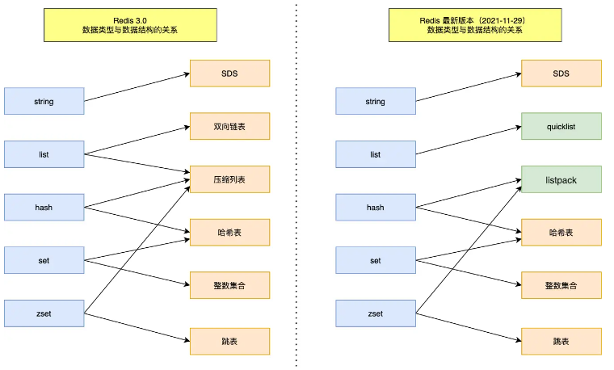


### 压缩列表的实现、连锁更新

压缩列表是 Redis 为了节约内存而开发的，它是由连续内存块组成的顺序型数据结构，有点类似于数组

表的头三个字段分别是：压缩列表**占用的内存**，**「尾部」节点距离起始地址**有多少字节，**节点数量**；所以如果我们要查找定位第一个元素和最后一个元素，可以通过表头三个字段（zllen）的长度直接定位，复杂度是 O(1)，其他就是O(N)

结点包含：**「前一个节点」的长度、当前节点实际数据的「类型和长度」、当前节点的实际数据**

当我们往压缩列表中插入数据时，压缩列表就会根据数据类型是字符串还是整数，以及数据的大小，会使用不同空间大小的 prevlen 和 encoding 这两个元素里保存的信息

但是他有一个缺陷就是会发生**连锁更新**，新增某个元素或修改某个元素时，如果空间不不够，压缩列表占用的内存空间就需要重新分配。而当新插入的元素较大时，可能会导致后续元素的 prevlen 占用空间都发生变化，从而引起「连锁更新」问题，导致每个元素的空间都要重新分配，造成访问压缩列表性能的下降。


### ZSET的底层实现、什么是跳表？、跳表的随机层高是怎么做的、跳表的插入过程

**ZSET和跳表**

ZSET，即有序集合，是Redis提供的一种数据结构。它类似于Set，但其成员是唯一的且每个成员都关联着一个分数。这个分数用于对集合中的元素进行排序。ZSET在实现上采用了跳表(SkipList)和哈希表(HashTable)两种数据结构，其中跳表用于维护元素的排序，而哈希表则提供快速的元素查找。

跳表(SkipList)是一种随机化的数据结构，实质上就是一种可以进行二分查找的有序链表。跳表在原有的有序链表上面增加了多级索引，通过索引来实现快速查找。它不仅提高了搜索性能，同时也提高了插入和删除操作的性能。查询的时间复杂度是O(log n)，空间复杂度O(N)

**跳表节点层数设置**

首先，跳表节点的层数设置具有随机性。在Redis的跳表中，每个节点的层数是随机生成的，这种随机性有助于保持跳表的平衡，防止某一层级的节点过多，从而影响查询效率。具体来说，每个节点在初始化时都会被赋予一个基本的层数，通常是1层。然后，通过一个随机数生成器，决定该节点是否增加额外的层级。

其次，层数的增加遵循一定的概率分布规则。在Redis中，这个概率通常是由一个固定的概率因子P(25%)来控制的。每当需要增加一个新的层级时，系统会生成一个介于0和1之间的随机数p，并将其与概率因子P进行比较。如果p小于P，则节点的层数会增加一层。这个过程会重复进行，直到生成的随机数p大于或等于P为止。

值得注意的是，虽然每个节点的层数是随机设置的，但整体上跳表的层数分布是稳定的。这是由于大量的节点在层数设置上遵循相同的概率规则，因此从统计学的角度来看，跳表的层级结构会趋于稳定。

综上所述，跳表节点的层数设置是通过随机化和概率控制来实现的。

**跳表的插入过程**

一、创建新节点并设置值

1. 根据待插入元素创建一个新的节点
2. 将新节点的值设置为待插入元素的值。
3. 生成一个随机的层数

二、查找插入位置

1. 从跳表的最高层开始，从左到右依次检查每个节点的下一个节点。
2. 在每一层中，沿着前进指针（forward pointer）向右移动，直到找到第一个大于等于 `score` 的节点
3. 将每一层中找到的前驱节点保存到 `update` 数组中

三、更新前驱节点的指针

​	在每一层中，将 `update[i]` 的前进指针指向新节点，新节点的前进指针指向 `update[i]` 原本指向的节点

四、更新跳表层数

​	如果新节点的层数 `lvl` 比当前跳表的最大层数大，则更新跳表的最大层数

这个过程确保了跳表在插入新元素后仍然保持有序，并且通过随机化的层高设计，使得跳表在查询、插入和删除操作时都能保持高效的性能。

总的来说，Redis中跳表的插入过程是一个结合了有序链表和二分查找思想的优化算法它通过增加多级索引和随机化的层高设计来提高操作效率。

### 哈希表的扩容机制、rehash、渐进式rehash

**rehash介绍**

当哈希表中的键值对数量超过一定阈值时，为了保证哈希表的性能和稳定性，Redis会自动进行rehash操作。具体来说，rehash就是将哈希表中的所有键值对重新散列到新的哈希表中。

在rehash过程中，Redis会创建一个新的哈希表，其大小通常是原哈希表大小的两倍(扩容时)。然后，Redis会将原哈希表中的所有键值对重新散列到新哈希表中。这个过程中，Redis会使用新的哈希表大小来计算每个键值对的新哈希值，并将其插入到新哈希表的相应位置。

**渐进式Rehash**

为了避免一次性rehash导致的长时间阻塞，Redis采用了渐进式rehash的策略。这种策略将rehash操作分散到多个指令的执行过程中，从而降低了对系统性能的影响。

在渐进式rehash过程中，Redis会维护两个哈希表：**原哈希表和新哈希表**。当触发rehash操作时，新的键值对会直接存储到新哈希表中，而原有的键值对则会在后续的指令执行过程中逐渐被迁移到新哈希表中。这个过程是逐步完成的，因此称为渐进式rehash。

**Rehash触发条件**

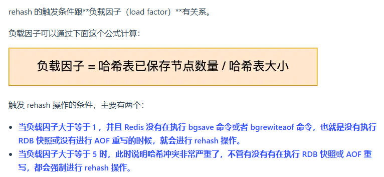

### 如何获取哈希表的字段，如何获取哈希表的hashKey，哈希表的api，判断哈希表中key是否存在

获得哈希表字段`HGET`

```java
HGET myhash field1
# 返回值：Hello
```

判断key是否存在`HEXISTS`

```java
EXISTS myhash
# 返回值：1
```


### ZSET为什么要用跳表，而不是用平衡树、红黑树或者B+树，用跳表的原因

**平衡树 vs 跳表**

跳表使用概率平衡而不是严格强制的平衡，因此，跳表中的插入和删除算法比平衡树的等效算法简单得多，速度也快得多

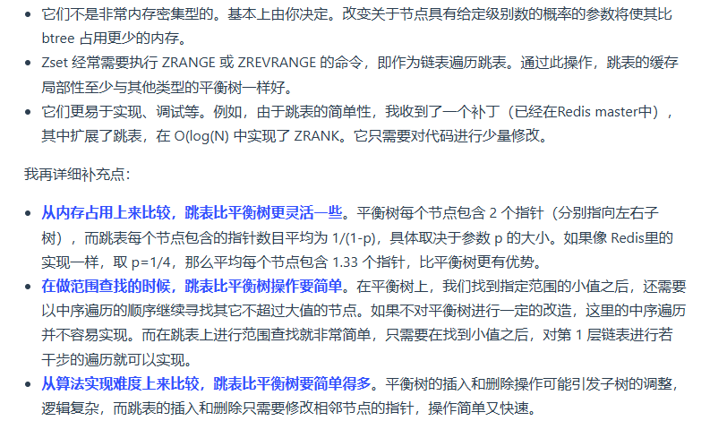

**红黑树 vs 跳表**

相比较于红黑树来说，跳表的实现也更简单一些。并且，按照区间来查找数据这个操作，红黑树的效率没有跳表高

**b+树 vs 跳表**

B+树更适合作为数据库和文件系统中常用的索引结构之一，它的核心思想是，通过可能少的 IO 定位到尽可能多的索引来获得查询数据，对于 Redis 这种内存数据库来说，它对这些并不感冒，因为 Redis 作为内存数据库它不可能存储大量的数据，跳表实现 zset 时相较前者来说更简单一些，也不需要像 B+树那样插入时发现失衡时还需要对节点**分裂与合并**

**使用跳表的原因**

1. 不是很占用内存，比 B+ 树更节省内存
2. 经常 `ZRANGE` 或 `ZREVRANGE` 操作的目标，以链表的方式遍历跳表，获取特定范围的元素效率高
3. 跳表的简单性，更好调试增强代码


## Redis持久化

### Redis的持久化、RDB、AOF、混合持久化、RDB和AOF的区别

首先是**RDB**持久化，是Redis**默认**的持久化方式，也就是创建快照来获得存储在内存里面的数据在某个时间点上的副本。这种方式是通过在指定的时间间隔内，将Redis内存中的数据集**生成快照**并写入到一个**二进制文件**中，通常是一个名为dump.rdb的文件。RDB的优点是生成的文件较小，且恢复速度快。比如，我们可以通过配置如“save 60 1000“这样的参数，告诉Redis在60秒内有1000个键被修改时，就自动保存一次数据集。当然，我们也可以手动执行save或bgsave命令来生成快照。但RDB的缺点是它可能会丢失一些数据，因为它是基于时间点的快照，而不是实时的。

接下来是**AOF**持久化，即Append Only File。每执行一条会更改 Redis 中的数据的命令，Redis 就会将该命令写入到 **AOF 缓冲区**，然后再写入到 **AOF 文件**中，最后再根据持久化方式的配置来决定何时将系统内核缓存区的数据**同步到硬盘**中的。当Redis重启时，它会重新执行AOF文件中的命令来恢复数据。AOF的优点是数据安全性更高，因为它记录了所有的写操作。但缺点是文件体积可能会很大且恢复速度相对较慢。

除了单独的RDB和AOF持久化外，Redis还支持混合持久化。这种方式结合了RDB和AOF的优点。混合持久化工作在AOF重写过程中，它首先使用RDB方式创建一个快照写入到AOF文件中，然后将后续的写命令追加到AOF文件中这样，在恢复数据时，Redis可以先加载快照以快速恢复到某个时间点，然后再通过执行AOF文件中的命令来恢复到最新状态。


### Redis先执行写操作命令，在写AOF日志的好处优势和坏处缺点

- 避免额外的检查开销，AOF 记录日志不会对命令进行语法检查；
- 在命令执行完之后再记录，不会阻塞当前的命令执行

也带来了风险：

- 如果刚执行完命令 Redis 就宕机会导致对应的修改丢失；
- 可能会阻塞后续其他命令的执行（AOF 记录日志是在 Redis 主线程中进行的）。


### AOF刷盘策略、AOF持久化方式、AOF三种刷盘策略

`always`：每个写命令都会立即同步到磁盘。这种方式虽然最安全，但性能开销也最大，因为每次写操作都需要进行磁盘I/O。

`everysec`：每秒同步一次。这是默认且推荐的策略，它在数据安全性和性能之间达到了一个平衡。

`no`：由操作系统决定何时同步到磁盘。这种方式性能最好，但数据安全性最低。


### AOF重写、AOF重写缓冲区、AOF瘦身、AOF过大的时候是怎么处理的

随着时间的推移，AOF文件会变得越来越大，这可能会影响到Redis的启动速度和恢复时间。为了解决这个问题，Redis提供了AOF重写(瘦身)的功能。AOF 文件重写期间，Redis 还会维护一个 **AOF 重写缓冲区**，该缓冲区会在子进程创建新 AOF 文件期间，记录服务器执行的所有写命令。当子进程完成创建新 AOF 文件的工作之后，服务器会将重写缓冲区中的所有内容追加到新 AOF 文件的末尾，使得新的 AOF 文件保存的数据库状态与现有的数据库状态一致。最后，服务器用新的 AOF 文件替换旧的 AOF 文件，以此来完成 AOF 文件重写操作。这个过程可以在不中断服务的情况下进行，并且通常会显著减小AOF文件的大小。AOF重写可以通过手动触发(使用bgrewriteaof命令)或根据配置的自动触发条件(如文件大小增长比例和时间间隔)来执行。


### 为什么RDB恢复比AOF快

RDB：直接将 RDB 文件中的二进制数据读入内存，反序列化数据到内存中，恢复整个数据集。

AOF：逐条读取 AOF 文件中的命令，逐条解析和执行命令，将数据恢复到内存中。


## Redis高可用

### Redis高可用怎么做的、Redis主从架构、Redis哨兵、Redis集群、Redis故障转移

Redis实现服务的高可用性主要依赖于几种关键机制：主从模式、哨兵机制和集群

首先是**主从模式**。在这种模式下，我们有一个主节点和多个从节点。主节点负责处理写入操作，而从节点则复制主节点的数据并处理读取请求。这种读写分离的设计可以提高系统的吞吐量和可用性。如果主节点出现故障，我们可以手动或通过自动化工具将一个从节点提升为主节点，以确保服务的连续性。

接下来是**哨兵机制**。Redis Sentinel是一个高可用的解决方案，它用于监控Redis节点的状态并在主节点出现故障时进行故障转移。哨兵会定期检查Redis节点的状态，并在检测到主节点故障时触发故障转移过程。这个过程包括选举一个新的主节点、通知其他从节点更新配置以及将客户端重定向到新的主节点等步骤。哨兵机制能够自动处理故障转移，从而大大提高了Redis服务的可用性。

最后是**集群**。Redis Cluster是Redis的分布式解决方案，它通过分片将数据分布在多个Redis节点上。每个节点都存储着一部分数据，并且节点之间可以通过Gossip协议相互通信。这种分布式架构不仅提高了数据的可扩展性，还增强了服务的可用性。当一个节点出现故障时，其他节点仍然可以继续提供服务，从而确保整体服务的可用性。

综上所述，Redis通过主从模式、哨兵机制、集群实现了服务的高可用性。这些机制能够确保在Redis节点出现故障时，服务仍然能够正常运行，并且数据不会丢失

### 大key和热key的定义、bigkey和hotkey的定义、bigkey和hotkey的例子

在Redis中，大Key指的是那些占用内存较大或者包含大量元素的Key，而热Key则是指访问频率非常高的Key。这两种情况都可能对Redis的性能和稳定性造成影响。大Key可能导致内存占用过高、网络传输效率低下以及备份恢复困难等问题；而热Key则可能引发读写倾斜，导致某些节点负载过高，甚至引发缓存击穿等风险。

大key的例子：

1.Key本身的数据量过大: 一个String类型的Key，它的值为5 MB.

2.Key中的成员数过多: 一个ZSET类型的Key，它的成员数量为10.000个

3.Key中成员的数据量过大: 一个Hash类型的Key，它的成员数量虽然只有2,000个但这些成员的Value(值)总大小为100 MB.

热key的例子：

1.QPS集中在特定的Key: Redis实例的总QPS(每秒查询率)为10.000，而其中一个Key的每秒访问量达到了7.000.

2.带宽使用率集中在特定的Key: 对一个拥有上千个成员目总大小为1 MB的HASH Key每秒发送大量的HGETALL操作

3.请求CPU使用时间占比集中在特定的Key: 对一个拥有数万个成员的Key(ZSET类型)每秒发送大量的ZRANGE操作请求。

### 大key和热key引发的问题、bigkey和hotkey引发的问题

大key:

1.客户端执行命令的时长变慢

2.Redis内存达到maxmemory参数定义的上限引发操作阻塞或重要的Key被逐出，甚至引发内存溢出(Out OfMemory)。

3.集群架构下，某个数据分片的内存使用率远超其他数据分片，无法使数据分片的内存资源达到均衡

4.对大Key执行读请求，会使Redis实例的带宽使用率被占满，导致自身服务变慢，同时易波及相关的服务

5.对大Key执行删除操作，易造成主库较长时间的阻，进而可能引发同步中断或主从切换。

热key:

1.占用大量的CPU资源，影响其他请求并导致整体性能降低

2.集群架构下，产生访问倾斜，即某个数据分片被大量访问，而其他数据分片处于空闲状态，可能引起该数据分片的连接数被耗尽，新的连接建立请求被拒绝等问题

3.在抢购或秒杀场景下，可能因商品对应库存Key的请求量过大，超出Redis处理能力造成超卖

4.热Key的请求压力数量超出Redis的承受能力易造成缓存击穿，即大量请求将被直接指向后端的存储层，导致存储访问量激增甚至宕机，从而影响其他业务。

### 如何发现大key和热key、如何发现BigKey和HotKey

对于大Key的发现，我们可以采用以下几种方法：

1. 使用Redis自带的命令，如`--bigkeys`选项，对Redis进行扫描，找出各种数据类型中最大的Key。
2. 利用 `MEMORY USAGE` 命令查看特定Key的内存使用情况，从而判断其是否为大Key。
3. 借助第三方工具进行扫描和分析，如`redis-memory-analyzer`等

对于热Key的发现，可以考虑以下途径：

1. 通过Redis的`MONITOR`命令监控实时命令流，分析哪些Key被频繁访问
2. 使用第三方工具或自定义脚本统计每个Key的访问频率
3. 根据业务特点和历史数据，预判哪些Key可能会成为热Key
4. 使用Redis自带的命令，如`--hotkeys`选项

### 如何解决大key和热key、如何解决bigkey和hotkey

针对大Key问题，我们可以采取以下措施：

1. 拆分大Key：将一个大Key拆分成多个小Key，分散存储和访问压力。
2. 优化数据结构：选择更合适的数据结构来减少内存占用和提高访问效率。
3. 设置过期时间：为大Key设置合理的TTL，以便在一段时间后自动清理。

对于热Key问题，可以尝试以下方法：

1. 利用二级缓存：将热Key的数据缓存到离用户更近的地方，如使用本地缓存或CDN来减少对Redis的访问压力。
2. 数据分片：通过一定的策略将热Key分散到多个Redis节点上，实现负载均衡。
3. 优化查询逻辑：减少不必要的查询和重复查询，降低对热Key的访问频率。

### 热key过期防护方案

**解决办法**

- **使用 `TTL` 命令监控**：可以使用 `TTL <key>` 命令监控键的过期时间，并采取措施。
- **缓存预热**：为关键数据的热键实现缓存预热策略，以避免在键过期时对系统造成冲击。
- **限流和缓存穿透防护**：使用限流机制和缓存穿透防护（如 Bloom Filter）来减少对 Redis 的过度访问。

### 限流导致的热key问题

**问题**

- 如果某个热键在限流策略应用之前已经成为热点，限流可能无法有效地分散请求，导致大量请求集中在少数热键上
- 当热键的访问量超过了限流的阈值，超出限流的请求可能会被丢弃或排队，导致系统的请求积压，降低用户体验或导致服务不可用。
- 限流可能导致请求不均匀地分配到不同的节点上，特别是在 Redis 集群中，某些节点可能会处理更多的请求。

**解决办法**

- 使用动态限流策略，根据实时负载和请求模式调整限流阈值。**基于令牌桶算法**：使用令牌桶算法进行限流，可以平滑处理请求并防止突发流量对系统的影响
- 使用负载均衡技术，将请求均匀分配到不同的 Redis 节点，在 Redis 集群中，将数据合理分片，减少单个节点的负载压力，实现负载均衡

### Redis集群是怎么计算key在哪个redis节点上的

Redis 集群使用哈希槽（hash slots）机制来管理数据分布，Redis Cluster 通常有 **16384** 个哈希槽 ，要计算给定 key 应该分布到哪个哈希槽中，需要先对每个 key 计算 **CRC-16**（XMODEM） 校验码，然后再对这个校验码对 16384(哈希槽的总数) 取模，得到的值即是 key 对应的哈希槽。

每个节点负责一部分哈希槽，集群配置文件中保存了每个节点负责的哈希槽范围

要先根据 key 通过上⾯的计算对应的哈希槽，然后再查询哈希槽和节点的映射关系，即可找到⽬标节点。

### Redis哨兵中节点之间是怎么互相检测的、Redis集群中节点之间是怎么相互检测的

一个哨兵节点在指定时间内（例如几秒钟）没有收到主节点的响应，会将主节点标记为主观下线，如果大多数哨兵节点都认为主节点无响应，则会将其标记为客观下线。

在 Redis 集群中，节点间会相互监控，每个 Redis 节点都会定期向其他节点发送 PING 消息，检测节点是否正常运行。多个节点确认某个节点为 PFAIL 后，会将其标记为失败。

### 主节点宕机下线时会发生什么，Redis哨兵机制工作过程、工作原理，Redis集群工作原理

**哨兵机制**

1. 选举领头哨兵
   - 当主节点被标记为客观下线后，哨兵节点会通过投票选举出一个领头哨兵节点。
   - 领头哨兵负责执行故障转移操作
2. 选举新的主节点
   - 领头哨兵节点会从剩余的从节点中选举出一个新的主节点。
     - 选择数据最接近主节点的从节点
     - 从节点可以设置不同的优先级，优先级高的从节点更容易被选为新的主节点
   - 哨兵节点发送 SLAVEOF NO ONE 命令给被选中的从节点，将其提升为新的主节点。
3. 重新配置其他从节点
   - 新的主节点上任后，哨兵节点会发送命令给其他从节点，其他从节点会被重新配置，指向新的主节点进行数据同步
4. 通知客户端
   - 哨兵节点会将新的主节点地址通知给所有连接的客户端
5. 将旧主节点变为从节点

​	故障转移操作最后要做的是，继续监视旧主节点，当旧主节点重新上线时，哨兵集群就会向它发送SLAVEOF 命令，让它成为新主节点的从节点

**集群中**

1. 节点之间通信检测
   - 集群中的每个节点都会定期向其他节点发送 PING 消息，检测其状态
   - 如果一个节点在指定时间内没有响应其他节点的 PING 消息，该节点会被标记为 PFAIL（可能失败）
   - 多个节点确认该节点无响应后，会将其标记为 FAIL（失败）
2. 选举新节点
   - 集群会选举一个新的主节点
     - 选择数据最接近主节点的从节
     - 从节点可以设置不同的优先级
   - 集群发送 SLAVEOF NO ONE 命令给被选中的从节点，将其提升为新的主节点。
   - 新的主节点接管原主节点的哈希槽，继续提供服务
3. 配置从节点
   - 集群发送命令给其他从节点，让它们开始同步新的主节点
4. 更新集群元数据
   - 集群中的所有节点更新它们的路由表，确保数据请求能够正确路由到新的主节点
   - 客户端连接的节点会接收新的集群状态信息，并更新它们的路由表

### Redis集群有什么问题？脑裂是什么？脑裂怎么解决？Redis主从数据不一致怎么办

**脑裂**

在 Redis 主从架构中，部署方式一般是「一主多从」，主节点提供写操作，从节点提供读操作。 如果主节点的网络突然发生了问题，它与所有的从节点又举出一个 leader 作为主节点

当主节点发现从节点下线或者通信超时的总数量小于阈值时，那么禁止主节点进行写数据，直接把错误返回给客户端。
在 Redis 的配置文件中有两个参数我们可以设置：

- min-slaves-to-write x，主节点必须要有至少 x 个从节点连接，如果小于这个数，主节点会禁止写数据。
- min-slaves-max-lag x，主从数据复制和同步的延迟不能超过 x 秒，如果超过，主节点会禁止写数据。

**数据一致性**

Redis 集群采用了以下机制来确保数据一致性，并处理潜在的一致性问题

1. 数据分片
2. 主从复制
   - **异步复制**：主节点和从节点之间的数据同步是异步的。从节点会定期从主节点同步数据，主节点的写操作不会等待从节点的确认，这可以提高性能，但可能会导致短暂的数据不一致。
   - **故障转移**：当主节点故障时，从节点可以提升为新的主节点。这是通过哨兵机制或 Redis 集群的内部故障转移机制来实现的。
3. 使用 RDB 和 AOF 持久化机制来保护数据，确保即使主节点故障也能从持久化存储中恢复数据。

### 什么是Raft算法

共识算法就是让分布式系统中的节点就⼀个问题达成共识。在 选举 leader 这个场景下，这些 从节点要达成的共识就是谁才是 leader

大概说一下就是，节点在选举过程中变为候选者，并请求其他节点的投票。节点获得超过半数的投票后，成为领导者，领导者将日志条目复制到所有跟随者，并等待确认，一旦日志条目被大多数节点确认，领导者将这些条目提交到日志中，并通知跟随者


## Redis应用

### 缓存穿透、缓存击穿、缓存雪崩

**缓存穿透**

缓存穿透是指**查询一个Redis和Mysql都不存在的数据**。正常的使用缓存流程大致是，数据查询先进行缓存查询，如果key不存在或者key已经过期，再对数据库进行查询，并把查询到的对象，放进缓存。如果数据库查询对象为空，则不放进缓存。持续查询不存在的数据会导致所有请求都落到后端存储上，导致系统瘫痪。

*解决办法*

1. 非法请求限制

   在 API 入口处我们要判断求请求参数是否合理，请求参数是否含有非法值、请求字段是否存在，如果判断出是恶意请求就直接返回错误，避免进一步访问缓存和数据库

2. 缓存空值或者默认值

   发现缓存穿透的现象时，可以针对查询的数据，在缓存中设置一个空值或者默认值，这样后续请求就可以从缓存中读取到空值或者默认值，返回给应用，而不会继续查询数据库

3. 使用布隆过滤器

   在写入数据库数据时，使用布隆过滤器做个标记，然后在用户请求到来时，业务线程确认缓存失效后，可以通过查询布隆过滤器快速判断数据是否存在，如果不存在，就不用通过查询数据库来判断数据是否存在

**缓存击穿**

缓存击穿是指一个**热点数据失效后**，大量请求同时涌入后端存储，导致后端存储负载增大、响应时间变慢，甚至瘫痪。

可以发现缓存击穿跟缓存雪崩很相似，可以认为缓存击穿是缓存雪崩的一个子集。

*解决办法*

1. 设置互斥锁，如果发现访问的数据不在 Redis 里，就加个互斥锁，保证同一时间内只有一个请求来构建缓存（从数据库读取数据，再将数据更新到 Redis 里），当缓存构建完成后，再释放锁
2. 缓存不过期，使用缓存预热和自动刷新机制。

**缓存雪崩**

缓存雪崩是指缓存由于某些原因(如**大量数据同时过期或Redis 故障宕机**)整体崩溃，导致大量请求到达后端数据库，从而导致数据库崩溃

*解决方案*

大量数据同时过期：

1. 设置不同的过期时间，避免缓存集中失效。
2. 设置互斥锁，如果发现访问的数据不在 Redis 里，就加个互斥锁，保证同一时间内只有一个请求来构建缓存（从数据库读取数据，再将数据更新到 Redis 里），当缓存构建完成后，再释放锁
3. 缓存不过期，使用缓存预热和自动刷新机制。

redis故障宕机：

1. 通过主从节点的方式构建 Redis 缓存高可靠集群
2. 应用程序限流，避免过多请求同时到达数据库，只将少部分请求发送到数据库进行处理，再多的请求就在入口直接拒绝服务

### 数据库和缓存如何保证数据一致性、数据缓存一致性、为什么要先更新数据库在删除缓存

**先更新数据库再更新缓存**


**先更新缓存再更新数据库**


**先删除缓存再更新数据库**


**先更新数据库再删除缓存**


**解决方案**

首先根据上面分析选择 先更新数据库，再删缓存 比较好，但是要保证这两个操作都能执行成功，有2个办法

1. 结合消息队列和重试机制
   - 当更新数据库成功后，可以将删除缓存的操作放入消息队列中，如果删除缓存失败，可以利用消息队列的重试机制来重新尝试删除操作。
   - 优点：这种方法能够确保即使初次删除缓存失败，也能通过重试机制最终达到数据一致性。
   - 注意事项：需要合理配置消息队列和重试策略，以避免对系统造成过大的压力。
2. 订阅MySQL binlog
   - 更新数据库成功，就会产生一条变更日志，记录在 binlog 里，使用 binlog 订阅工具，实时捕获数据库变更，并同步更新删除缓存，从而保证数据库和缓存的一致性。
   - 即使 Redis 第一次删除缓存失败，根据 binlog 事件内容来判断，然后回重试

### 延迟双删

针对「先删除缓存，再更新数据库」方案在「读 + 写」并发请求而造成缓存不一致的解决办法是「延迟双删」。

```
#删除缓存
redis.delKey(X)
#更新数据库
db.update(X)
#睡眠
Thread.sleep(N)
#再删除缓存
redis.delKey(X)
```

### 布隆过滤器原理

布隆过滤器由「初始值都为 0 的位图数组」和「 N 个哈希函数」两部分组成，在写入数据库数据时，在布隆过滤器里做个标记，这样下次查询数据是否在数据库时，只需要查询布隆过滤器，如果查询到数据没有被标记，说明不在数据库中

分3个操作：

1. 使用 N 个哈希函数分别对数据做哈希计算，得到 N 个哈希值
2. 将第一步得到的 N 个哈希值对位图数组的长度取模，得到每个哈希值在位图数组的对应位
3. 将每个哈希值在位图数组的对应位置的值设置为 1

比如：假设有一个位图数组长度为 8，哈希函数 3 个的布隆过滤器


数据 x 会被 3 个哈希函数分别计算出 3 个哈希值，取模之后是1，4，6，把位图数组的第 1、4、6 位置的值设置为 1，查询时，看1，4，6，如果有0就是不存在。

存在哈希冲突的可能性，数据 x 和数据 y 可能都落在第 1、4、6 位置，而事实上，可能数据库中并不存在数据 y。

所以查询布隆过滤器说数据存在，并不一定证明数据库中存在这个数据，但是查询到数据不存在，数据库中一定就不存在这个数据。


### Redis是怎么实现分布式锁的？除了Redis还有哪些可以做分布式锁

分布式系统下，不同的服务/客户端通常运行在独立的 JVM 进程上。如果多个 JVM 进程共享同一份资源的话，使用本地锁就没办法实现资源的互斥访问了。于是，**分布式锁** 就诞生了

**Redis实现分布式锁**

1. 互斥

   Redis的 `SETNX` 命令是实现分布式锁的基础。当一个客户端尝试获取锁时，它会使用 SETNX 来设置一个键。如果键不存在， `SETNX` 会设置该键并返回1表示成功获取了锁。如果键已经存在，SETNX不会做任何事情并返回0，表示获取锁失败。

2. 锁操作原子性

   Lua 脚本是为了保证解锁操作的原子性。因为 Redis 在执行 Lua 脚本时，可以以原子性的方式执行，从而保证了锁释放操作的原子性。

3. 设置过期时间

   但是，仅仅使用 `SETNX` 是不够的。如果持有锁的客户端在处理过程中崩溃或网络断开那么锁可能永远不会被释放，导致其他客户端永远无法获取锁，这就是所谓的死锁。为了防止这种情况，我们需要为锁设置一个过期时间。在Redis中，这可以通过 `EXPIRE` 命令来实现。

4. 看门狗实现自动续期

   Redisson 中的分布式锁自带自动续期机制，提供了一个专门用来监控和续期锁的 **Watch Dog（ 看门狗）**，如果操作共享资源的线程还未执行完成的话，Watch Dog 会不断地延长锁的过期时间，进而保证锁不会因为超时而被释放。

5. 集群情况下

   `Redlock`算法，让客户端向 Redis 集群中的多个独立的 Redis 实例依次请求申请加锁，如果客户端能够和半数以上的实例成功地完成加锁操作

**其他方式实现分布式锁**

1. 基于数据库的分布式锁
   我们可以利用数据库来实现分布式锁。例如，在MySQL中，可以使用 `SELECT...FOR UPDATE` 语句来锁定某一行数据。当一个事务在对数据执行修改操作前，先使用此语句锁定该行，其他事务在此期间无法对该行进行修改，从而实现了锁的效果。但需要注意的是，数据库锁可能会引起性能瓶颈，特别是在高并发场景下。
2. 基于Zookeeper的分布式锁
   Zookeeper是一个开源的分布式协调服务，它可以帮助我们实现分布式锁。在Zookeeper中，我们可以创建一个临时的顺序节点来表示锁。当客户端需要获取锁时，它会在指定的目录下创建一个顺序节点。然后，客户端会检查自己创建的节点是否是最小的节点，如果是，则获取到锁；如果不是，则监听比自己序号小的前一个节点。当前一个节点被删除时，客户端会收到通知并重新检查自己是否是当前最小的节点。这种方式可以有效地避免死锁，并且具有较好的性能。

### 为什么用Redisson实现分布式锁而不是Redis，Redisson实现分布式锁的优势

1. `SETNX` 和 `EXPIRE` 是两个独立的命令，因此在网络延迟或服务器故障的情况下，`SETNX` 成功但 `EXPIRE` 失败，会导致死锁，因为锁没有过期时间
2. Redis 原生的分布式锁并不支持重入。即，如果同一个线程或进程多次获取锁，可能会陷入死锁
3. Redisson 内部实现的分布式锁使用 Lua 脚本将 `SETNX` 和 `EXPIRE` 两个操作原子化
4. Redisson 提供了**可重入锁**，即同一线程可以多次获取同一个锁，而不会导致死锁。这是通过内部记录每个锁的持有线程及重入次数实现的
5. Redisson 提供了**看门狗机制**，自动续期功能保证在持有锁的过程中不会因为锁的过期时间导致锁意外释放。


### Redisson的看门狗机制、Redisson设置分布式锁的过程

看门狗：

看门狗在你没有指定锁过期时间时自动启用。

没传**自动释放锁时间**的话，就会给一个默认值，这个默认值就是getLockWatchdogTimeout()，也就是看门狗超时时间，是30秒

每隔固定时间（默认每隔 10 秒）检查一次锁的状态。如果发现锁仍然被持有，Redisson 会向 Redis 发送命令，延长锁的过期时间，将其重置为 30 秒。这个过程会持续到锁被主动释放为止

当客户端主动调用 `unlock()` 方法时，Redisson 会取消看门狗的调度，释放锁，同时删除 Redis 中的锁键。

**分布式锁的核心功能其实就三个：加锁、解锁、设置锁超时**

使用hash数据结构

Redisson使用了redis的发布订阅功能

加锁：Redisson的加锁方法有两个，**tryLock**和**lock**

订阅分布式锁, 解锁时进行通知

- 先用`exists key`命令判断是否锁是否被占据了，没有的话就用`hset`命令写入，key为锁的名称，field为“客户端唯一ID:线程ID”，value为1；
- 锁被占据了，判断是否是当前线程占据的，是的话value值加1；（实现可重入的效果）
- 锁不是被当前线程占据，返回锁剩下的过期时长

### Redisson有哪些锁(可重入锁、公平锁、读写锁、联锁、红锁)

**可重入锁**（Reentrant Lock）：允许同一线程多次获取锁。

**公平锁**（Fair Lock）：按照请求锁的顺序公平获取锁。

**读写锁**（ReadWrite Lock）：支持多个读线程同时访问，但写线程独占。

**联锁**（MultiLock）：可以同时锁定多个资源，所有资源都锁定成功才算获取到锁。

**红锁**（RedLock）：Redisson 的红锁实现基于 Redis 分布式系统的高可用性，按照 Redis 作者提出的算法实现分布式锁。

### Redis的消息队列、Redis的Stream的特点、Redis的Stream比List好在哪里

**可以是可以，但不建议使用 Redis 来做消息队列。和专业的消息队列相比，还是有很多欠缺的地方**。

Redis2.0之前用List实现简单的消息队列，2.0引入了发布订阅功能，使用channel（频道）来实现

主要说一下Redis5.0增加的Stream做消息队列

- 发布 / 订阅模式
- 按照消费者组进行消费（确保每条消息只被一个消费者处理一次）
- 消息持久化（ RDB 和 AOF）
- ACK 机制（通过确认机制来告知已经成功处理了消息）
- 阻塞式获取消息

大致实现就是`XREAD`命令从Stream 中读取消息，`XGROUP CREATE`创建消费者组，`XREADGROUP`从消费者组中读消息，`XACK`确认处理

### Redis的事务？支持原子性吗？支持回滚吗？

支持的，通过`MULTI`、`EXEC`、`DISCARD` 和 `WATCH` 命令来实现

**`MULTI`**：开始一个事务块，之后的命令会被加入到事务队列中。

**`EXEC`**：提交事务

**`DISCARD`**：取消事务块，丢弃事务队列中的所有命令

**`WATCH`**：用于实现乐观锁机制，监视一个或多个键。当这些键在事务执行期间发生变化时，事务会被中止

在事务开始（`MULTI`）之后但在事务提交（`EXEC`）之前发生宕机：不会被执行

在事务提交（`EXEC`）之后但在事务执行期间发生宕机：会看到部分事务命令已经生效

在 `MULTI` 和 `EXEC` 之间的所有命令都会被排入事务队列，在 `EXEC` 被调用时，事务队列中的命令会按顺序逐一执行，而不会被其他命令中断，是**支持原子性**的

如果事务执行过程中出现错误，Redis 会终止事务，并且所有未执行的命令不会被执行，但已成功执行的命令**不会被回滚**。

### Redis怎么统计网站pv，uv

PV 表示页面浏览量，UV 是指不同用户访问页面的数量

pv可以使用`INCR`命令，每次被访问就+1

使用 Redis 的 `SET` 数据结构，每次页面被访问时，将用户 ID 加入集合，获取集合中的数量，命令就是`SADD`和`SCARD`

大数据量下可以用HyperLogLog

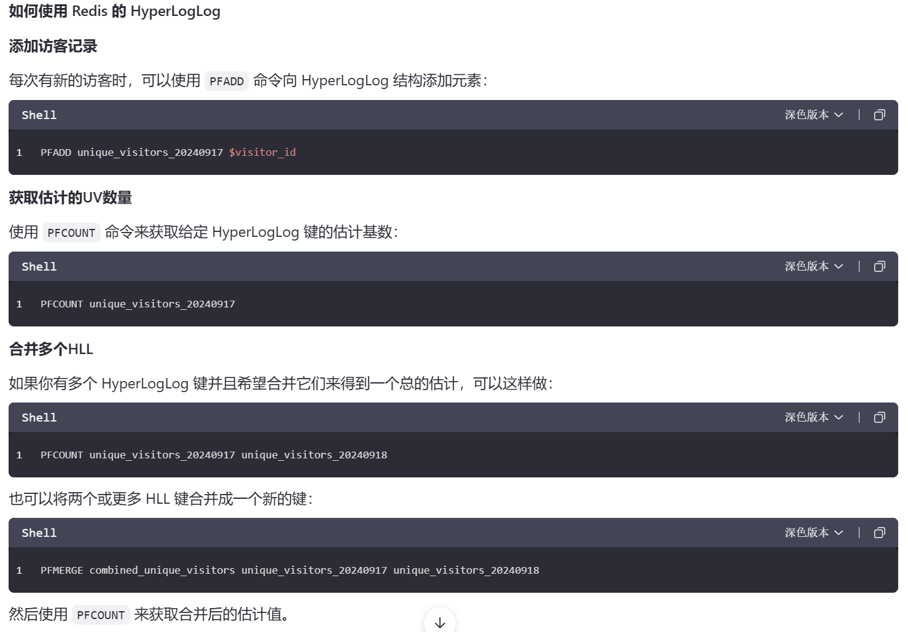


# Git

## Git命令有哪些

**`git init`**：初始化一个新的 Git 仓库

**`git clone <repository>`**：克隆一个远程仓库到本地

**`git add <file>`**：将文件添加到暂存区

**`git commit -m "message"`**：提交暂存区的更改到本地仓库。

**`git log`**：查看提交历史

**`git rm <file>`**：删除工作区和暂存区中的文件

**`git branch`**：列出、创建或删除分支

**`git merge <branch>`**：将指定分支的更改合并到当前分支

**`git remote`**：管理远程仓库

**`git pull`**：从远程仓库获取并合并最新的提交

**`git push`**：将本地的提交推送到远程仓库


## Git如何解决冲突、Git冲突

**识别冲突**：Git 会告诉你哪些文件有冲突。使用 `git status` 查看这些文件。

**解决冲突**：打开冲突文件，你会看到分隔标记（如 `<<<<<<< HEAD` 和 `>>>>>>> branch-to-merge`）。手动编辑文件，决定保留哪些更改或合并它们。

**标记已解决**：编辑完成后，使用 `git add` 将这些文件标记为已解决。

**完成合并**：执行 `git commit` 完成合并操作。如果是拉取操作，使用 `git pull --continue` 继续。

**推送更改**：如果是远程分支，推送更改到远程仓库。


# Docker

## Docker命令有哪些

**容器管理**

`docker run`：启动新容器。

`docker ps`：列出运行中的容器。

`docker ps -a`：列出所有容器。

`docker stop`：停止容器。

`docker start`：启动已停止的容器。

`docker restart`：重启容器。

`docker rm`：删除容器。

`docker exec`：在容器内执行命令。

`docker logs`：查看容器日志。


**镜像管理**

`docker pull`：下载镜像。

`docker build`：构建镜像。

`docker images`：列出镜像。

`docker rmi`：删除镜像。

`docker tag`：添加镜像标签。


**网络管理**

`docker network ls`：列出网络。

`docker network inspect`：查看网络信息。

`docker network create`：创建网络。

`docker network rm`：删除网络。


**卷管理**

`docker volume ls`：列出卷。

`docker volume inspect`：查看卷信息。

`docker volume create`：创建卷。

`docker volume rm`：删除卷。


**系统管理**

`docker info`：显示系统信息。

`docker version`：显示版本信息。

`docker system df`：显示磁盘使用情况。

`docker system prune`：清理未使用的数据。


**其他：**

`docker-compose`：管理多容器应用。


## Docker的概念（镜像、容器、Docker compose、数据卷的概念)

1. 镜像 (Image)
    定义：镜像是一个只读的模板，用于创建 Docker 容器。它包含了应用程序及其所有依赖项、库和设置。
    用途：可以理解为容器的快照，用于定义容器的文件系统和环境配置。
    创建：镜像通常从 Dockerfile 构建，也可以从 Docker Hub 或其他镜像仓库中拉取。

2. 容器 (Container)
    定义：容器是镜像的一个可运行实例。它是一个轻量级、独立的运行时环境，用于执行应用程序。
    用途：容器提供了隔离的执行环境，运行时数据可写，但容器的文件系统是基于镜像的，镜像本身是不可变的。
    生命周期：容器可以启动、停止、重启或删除。

3. Docker Compose
    定义：Docker Compose 是一个工具，用于定义和运行多容器 Docker 应用。
    用途：通过编写 docker-compose.yml 文件，用户可以定义多个服务、网络和卷，便于协调和管理多容器应用。
    命令：常用命令包括 docker-compose up（启动服务）、docker-compose down（停止服务）等。

4. 卷 (Volume)
    定义：卷是用于持久化和共享容器数据的机制。
    用途：卷可以在容器之间共享数据，也可以在容器停止或删除后保留数据。它们适用于存储数据库、日志等需要持久保存的数据。
    管理：卷可以通过 docker volume 命令进行创建、查看和删除。

5. Dockerfile
    定义：Dockerfile 是一个文本文件，包含了一系列指令，用于自动化构建 Docker 镜像。
    用途：通过编写 Dockerfile，可以定义镜像的构建步骤，例如安装软件、复制文件、设置环境变量等。
    构建：使用 docker build 命令从 Dockerfile 创建镜像。

6. Docker Hub
    定义：Docker Hub 是一个公共的 Docker 镜像仓库，提供了镜像的分享和管理功能。
    用途：用户可以从 Docker Hub 拉取公共镜像，也可以将自己的镜像推送到 Docker Hub 供他人使用。
    访问：Docker Hub 提供了镜像的查找、下载和上传功能。

7. 网络 (Network)
    定义：Docker 网络允许容器之间以及容器与外界的通信。
    用途：可以创建自定义网络，以便容器可以在隔离的网络环境中进行通信。常见的网络模式包括桥接网络、主机网络和自定义网络。
    管理：网络可以通过 docker network 命令进行创建、查看和管理。

  # 支付系统

## 为什么使用Redisson分布式锁和Redis的SETNX命令

首先，我们先使用SETNX命令判断当前请求是否为重复调起支付接口请求，具体实现是我将这个Key设置为：商户ID + 订单ID + 英文单词"submit", 意思是这个商户的这个订单去支付的这个接口当前只能被调用一次，如果是重复调起支付请求，则抛一个异常告诉客户端不要频繁点击。

判断完是否为重复调起支付接口请求后，我们在通过Redisson的getLock获取到RLock对象，这个锁的Key为 "lock" + 商户id + 订单id，对同一商户的同一订单做并发安全处理。之前也有看到过一个业务场景，当我们使用美团下单后，调起支付界面时，用另一部手机登录同一个美团账号，在订单列表去支付刚创建的订单，这时就会出现同一个订单却能进入到两个支付界面的问题。但是如果我们在第一部手机调起支付接口时就获取了分布式锁，那么第二部手机尝试去调起支付接口时就会因为获取不到锁而进不到支付界面


## Redisson分布式锁和Redis的SETNX实现的分布式锁的区别

Redis 的 `SETNX` 实现

1. **基础命令**:

   - `SETNX`（SET if Not eXists）是 Redis 中的一个命令，用于在键不存在时设置键的值。如果键已经存在，命令将不执行任何操作。
   - 在分布式锁的场景中，通常使用 `SETNX` 来尝试获取锁：如果成功，表示获取了锁；如果失败，表示锁已经被其他客户端持有。

2. **简单性**:

   - `SETNX` 实现分布式锁比较简单，但需要手动处理锁的过期时间，以避免锁无法释放的问题。
   - 你需要使用 `EXPIRE` 命令来设置锁的过期时间，从而防止锁因某些原因无法被释放，导致死锁。

3. **缺乏高级特性**:

   - 仅使用 `SETNX` 可能没有集成更多的功能，比如锁的自动续期、可重入、锁的可视化状态等。

   

Redisson 实现

**高级功能**:

- Redisson 是一个基于 Redis 的 Java 客户端，提供了很多高级功能，包括分布式锁。
- Redisson 的 `RLock` 实现了很多 Redis 的 `SETNX` 没有的功能，比如自动续期、可重入锁、锁的公平性等。

**自动续期**:

- Redisson 的分布式锁实现支持自动续期功能，即在锁持有者处理任务时，如果任务运行时间超过了锁的初始过期时间，Redisson 可以自动延续锁的有效时间，从而避免锁超时而导致任务失败的问题。

**锁的公平性**:

- Redisson 支持公平锁，即按照请求的顺序来获取锁，避免了“饥饿”问题。公平锁保证了请求锁的顺序性。

**锁的可重入性**:

- Redisson 支持可重入锁，允许同一线程多次获取同一把锁，而不会造成死锁。

**更多操作和监控**:

- Redisson 提供了更多的操作和监控功能，例如查看锁的持有者、剩余时间等，方便对分布式锁的管理和调试。


##  为什么要去使用Nacos

Nacos作为一个注册中心和配置中心，可以更好的为服务进行配置和管理。就拿我的项目来说，我对每个具体的业务是有进行服务的拆分的，比如说订单服务，商家服务（负责对接商家的请求，比如说为当前的订单生成一个二维码），支付服务、用户服务（负责管理系统中的用户crud，还有管理登录之类的）等，使用Nacos就可以更方便的去进行服务的发现，而不是在代码里硬编译服务的地址。而且像一些比较统一的配置，比如说redis和mysql的配置，使用Nacos就可以做到一次配置，多个服务使用同一份配置，极大的省去了配置的麻烦和方便了管理.


##  你说到了你对服务进行了拆分，那你能讲讲你是怎么进行服务间的调用的吗，讲一下Dubbo的工作流程

我具体在项目中使用的是Dubbo，Dubbo 是一个高性能的 Java 分布式服务框架，它主要用于构建大规模分布式系统，提供了一个通用的 RPC（Remote Procedure Call）服务框架，帮助我们轻松地构建和管理微服务架构

工作流程：

1. **服务提供者注册服务**
**服务定义：**服务提供者首先定义服务接口和实现类。接口定义了服务的功能，而实现类提供了具体的业务逻辑。
**启动时注册：**当服务提供者启动时，它会向注册中心（如 ZooKeeper、Nacos 等）注册自己的服务信息，包括服务接口、实现类、协议、端口等。

2. **服务消费者订阅服务**

  **服务发现：**服务消费者在启动时，会向注册中心查询可用的服务提供者信息。消费者从注册中心获取服务提供者的地址和其他信息。

  **订阅更新：**消费者订阅服务的变化，注册中心会将服务提供者的变更（如新增、下线等）通知消费者。服务调用

3. **服务调用**
    **接口代理：**在服务消费者端，Dubbo 创建一个服务接口的代理对象。消费者通过调用这个代理对象的方法，实际上是发起了远程调用。
    **调用发送：**代理对象将方法调用封装成请求消息，通过指定的协议（如 Dubbo 协议、HTTP 协议等）发送到相应的服务提供者。

4. **服务提供者处理请求**
    **请求接收：**服务提供者接收到来自消费者的请求消息后，Dubbo 服务器解码请求，并将其转发给相应的服务实现类。
    **业务处理：**服务实现类处理业务逻辑，并生成响应结果。

5. **响应返回**
    **响应编码**：服务实现类处理完成后，将响应结果封装成消息，并通过 Dubbo 协议发送回消费者。
    **结果接收**：消费者端的代理对象接收到响应消息后，解码并返回最终的结果给调用者。

6. 负载均衡和容错
负载均衡：在服务调用过程中，Dubbo 可以根据负载均衡策略选择合适的服务提供者，以均衡负载和提高性能。
容错处理：Dubbo 也支持容错处理策略，例如重试、熔断等，确保服务调用的可靠性和稳定性。

7. 动态配置与监控
动态配置：Dubbo 支持动态配置，可以在不重启服务的情况下修改服务的配置，例如修改超时时间、负载均衡策略等。
监控与统计：Dubbo 提供监控和统计功能，


## Dubbo底层用的网络协议

1. **Dubbo 协议**
Dubbo 协议是 Dubbo 自定义的二进制协议，专门设计用于高效的远程调用。它在性能和效率方面经过优化，支持高并发、低延迟的服务通信。
特性：高效性：采用二进制编码，减少了网络传输的数据量，提高了传输速度。
支持多种 RPC 调用方式：包括单向调用、同步调用、异步调用等。
扩展性：支持多种扩展点，如序列化、负载均衡等。
2. **HTTP 协议**
    HTTP 协议是一种通用的文本协议，Dubbo 也可以通过 HTTP 协议进行通信，尤其是在需要与外部系统或使用 Web 服务时。
    特性：兼容性：支持与各种网络服务进行交互，容易集成。
    适用场景：适合与其他系统进行通信或者用于非 Java 客户端的服务调用。
3. **Hessian 协议**
    Hessian 协议是一种轻量级的二进制协议，用于序列化和反序列化 Java 对象，提供高效的网络通信。
    特性：跨语言支持：不仅支持 Java，还可以与其他编程语言（如 PHP、Python）进行通信。
    适用场景：适用于需要高效数据交换的场景
4.  **RMI 协议**
    RMI（Remote Method Invocation）协议是 Java 自带的远程调用协议，也可以作为 Dubbo 的一种协议使用。
    特性：Java 原生支持：适用于纯 Java 环境中的远程调用。
    较高的开销：相比于 Dubbo 协议和 Hessian 协议，RMI 协议的性能开销较大。

选择协议的考虑因素
性能：Dubbo 协议通常在性能方面表现优异，适用于对性能要求较高的场景。
兼容性：HTTP 协议和 Hessian 协议在与其他系统或不同语言的交互中具有较好的兼容性。
扩展性：Dubbo 协议和 Hessian 协议支持扩展，能够满足各种定制化需求。


## 你还了解哪些RPC框架

**1.gRPC**
简介：由 Google 开发的高性能、开源的 RPC 框架，基于 HTTP/2 和 Protocol Buffers。
特点：高效性：HTTP/2 提供了多路复用、流控等功能，减少了网络延迟。
语言支持：支持多种编程语言，如 Java、C++、Python、Go 等。
双向流：支持双向流和流控，适合实时通信场景。


**2. Spring Cloud OpenFeign**
简介：基于 Spring Cloud 的声明式 Web 服务客户端，封装了 Feign 和 Ribbon，用于简化 HTTP 请求的处理。
特点：声明式 API：通过注解的方式声明服务接口，简化了代码编写。
集成 Spring Cloud：与 Spring Cloud 的其他组件（如 Eureka、Ribbon）无缝集成。


**3. Apache Thrift**
简介：由 Facebook 开发的跨语言服务框架，支持多种传输协议和数据格式。
特点：语言支持：支持多种编程语言，包括 Java、C++、Python、PHP、Ruby 等。
协议灵活：支持不同的传输协议（如 TCP、HTTP）和序列化格式（如 Binary、JSON）。


## 讲一下GRPC底层用了什么网络协议

1. HTTP/2（网络协议）
    简介：gRPC 使用 HTTP/2 作为传输层协议。HTTP/2 是 HTTP/1.1 的继任者，旨在提高网络性能，提供更高效的网络通信。
    特点：多路复用：允许在一个 TCP 连接上并发处理多个请求和响应，减少了网络延迟。
    流控：支持流量控制，避免了流量拥塞。
    头部压缩：使用 HPACK 算法压缩 HTTP 头部，减少了数据传输的开销。
    服务器推送：允许服务器主动推送资源到客户端，提升了响应速度。

2. Protocol Buffers (protobuf) （序列化机制）
    简介：gRPC 使用 Protocol Buffers 作为默认的数据序列化协议。Protocol Buffers 是 Google 开发的高效、语言中立的序列化格式。

   特点：高效性：采用二进制格式进行序列化和反序列化，数据传输更加高效。 

  紧凑性：数据结构紧凑，占用空间小，解析速度快。 

  跨语言支持：支持多种编程语言，如 Java、C++、Python、Go 等。 可扩展性：支持在不破坏旧版本的情况下添加新字段或修改现有字段。


## MapStruct和BeanUtils的区别

1. **实现方式**

- **MapStruct**:
  - **编译时生成代码**: MapStruct 是一个编译时注解处理器，它通过注解在编译期间生成对象映射的代码。你需要使用 `@Mapper` 注解标记接口，并定义映射规则，MapStruct 会在编译时生成具体的实现代码。
  - **性能**: 由于是在编译时生成代码，MapStruct 的性能通常较高，且生成的代码是静态的、类型安全的，不会有运行时的反射开销。
  - **类型安全**: 由于 MapStruct 在编译期间生成代码，映射过程是类型安全的。编译器可以检查映射规则是否正确，减少运行时错误。
- **BeanUtils**:
  - **运行时反射**: BeanUtils（特别是 Apache Commons BeanUtils）使用反射在运行时进行对象属性的复制。这种方法更灵活，但性能相对较低。
  - **性能**: 使用反射会带来额外的开销，通常会比 MapStruct 慢。尤其是在需要大量对象映射时，性能差异可能比较明显。
  - **灵活性**: BeanUtils 更加灵活，因为它允许在运行时动态处理属性，适合一些动态场景，但这也使得它的类型安全性较差。

**2.配置和灵活性**

- **MapStruct**：
  - **配置**：通过注解来配置映射关系，例如 `@Mapping` 注解用于指定字段映射规则。支持复杂的映射逻辑、转换器、条件映射等。
  - **灵活性**：提供了丰富的配置选项，支持定制映射逻辑、嵌套映射、自定义转换等。
- **BeanUtils**：
  - **配置**：通常较为简单，主要通过 `BeanUtils.copyProperties()` 方法进行属性复制，不提供灵活的配置选项。
  - **灵活性**：较为有限，主要适用于简单的属性拷贝，没有内建的支持复杂映射或自定义转换的能力。

3. **类型安全**

- **MapStruct**：
  - **类型安全**：MapStruct 生成的代码在编译时进行类型检查，因此在编译时能够捕获类型错误，提供更高的类型安全性。
  - **编译时检查**：映射关系在编译时验证，确保类型安全，避免运行时错误。
- **BeanUtils**：
  - **类型安全**：由于使用反射进行属性复制，类型错误通常只有在运行时才能发现。这可能导致潜在的运行时异常。
  - **运行时检查**：类型错误可能在运行时才被发现，降低了类型安全性。


## 如何生成支付二维码的，讲一下用户下单的流程（延迟查询，自动取消订单）

商家首先填入订单相关的信息，然后后台服务根据具体信息通过Zxing库生成二维码，用户扫描二维码后，支付服务会解析用户的端类型，调起相应的支付平台。此时支付服务会向mq里投递一条消息，这个消息中封装了两个值，一个是具体的支付参数，另一个是个List集合，里面将30min拆成了不同的时间小块，当每次去查询时，若用户还没支付，则从集合中移除队头元素，当队列被移除空了后，说明30分钟已到，用户还未支付，直接取消订单，实现了在30min这个区间内多次主动查询支付结果，而不是到30min后在去查询，防止了消息的堆积。这个业务逻辑有点像SpringTask定时任务那样。定时去执行一个任务


## 支付系统中的所有表

### 商户服务（app表、商户表、员工表、门店表)

app表：


商户表：

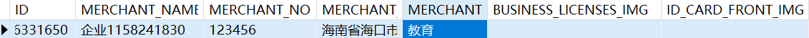

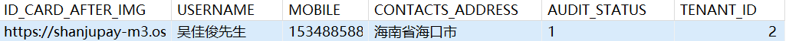


员工表：


门店表：


门店员工关联表：


### 支付服务（支付渠道表，支付参数表，订单表）

支付渠道表

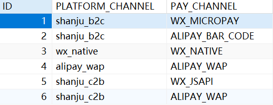


app支持的支付渠道表

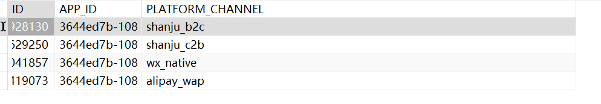

支付参数表：

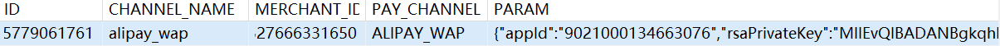


订单表：

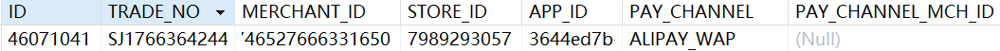


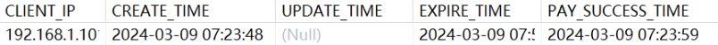


# 即时通讯系统

## 项目架构


接入接口api，网关层（netty的handler,负责识别消息中的命令，然后根据命令投递到指定的mq队列当中)、业务层（处理业务逻辑，比如说检验好友关系链，用户是否被禁言等功能就是在这实现的)、存储层（mq异步投递消息在此处进行持久化)


## 一致性哈希算法是怎么实现的

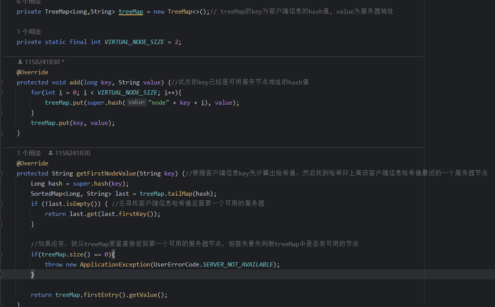

根据客户端传来的用户id先计算出哈希值，然后找到哈希环上离该用户id哈希值最近的一个服务器节点，具体是通过TreeMap.tailMap（hash）方法获得一个SortedMap视图，然后通过这个SortedMap.get(SortedMap.firstKey())获得第一个可用的服务器节点


## 多端登录功能是怎么实现的,用户是怎么发现在其他服务器上的设备的？

首先，用户在登录时会将自身的端类型，IMEI号等信息传给后端服务器，后端服务器的Netty的Handler在处理请求登陆时，会将这些信息连同服务器的ip和端口都封装到UserSession中，然后以hash类型存入redis中，key为appid + UserSession + UserId;

HashKey为端类型 + IMEI 号，HashValue 为UserSession,用户在其他设备登陆时，通过key查到Hash对象后，接着在通过端类型 + IMEI号判断是否会出现多端登录的冲突


## 单聊群聊消息收发是怎么实现的

用户发送消息后，请求先来到后端服务器的网关层，Netty通过判断消息中的命令来判断这是单聊消息还是群聊消息，然后根据消息命令投递到相应的mq队列中，消费者进一步消费，进行业务逻辑的处理


## 数据同步是怎么做的

用户在任意一端修改资料，发送消息等操作需要同步在其他在线端显示，于是我做了这个功能。首先通过appId + UserSession + userId 为key去redis中查询该用户所有在线的session,在通过这个session从concurrentHashMap中查出对应的channel,然后往channel写入用户操作数据即可


## 消息已读是怎么做的

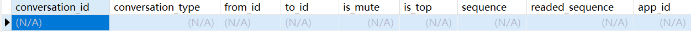

首先有一个会话表，记录用户的会话，在这个会话表中有个已读序列，记录当前用户已读到消息序列，消息发送方通过查询会话id下的已读消息序列，就知道哪些消息被读到了，哪些消息没有被读到

比如群聊a、用户b读到了100、用户c没有读到100，那么我们只更新用户B的会话

或者单聊下，用户b 读了 用户a发的消息，那么用户a只需查询他与用户b的会话就能查到被读到的消息序列，进而判断消息是否被已读


---以下能不说就不说--

如果是写扩散的模型下，也就是单聊的消息已读，每条消息索引有很多份在数据库中，我们为消息表的加上一个已读字段,当用户进入聊天界面时，向服务端上报已读的messagekey，服务端根据messageKey去修改已读字段


## 上下线通知

用户在登陆的时候，首先会通过查询好友关系表查出所有好友id，在通知哪些在线的好友，然后再去查询redis中的临时订阅用户，并且一并通知这些用户, redis中使用的数据结构是Hash，key为当前appId + subscribe + 当前登录的用户id, hashKey为订阅当前登录用户的用户id, hashValue为订阅过期时间


## 怎么设计协议解决TCP粘包、黏包问题的

自定义协议：指令命令、协议版本、端类型、消息类型、appId、imei长度、bodyLen


## 什么是读扩散，什么是写扩散

读扩散就是比如说A给B发送一条消息，这条消息只会持久化到A和B共同的信箱里，也就是数据库表字段中的fromId, ToId。而写扩散就是比如A给B发送一条消息，这条消息会分别持久化到A和B自己的信箱里，也就是数据库表字段中的fromId, ToId, ownerId, 其中这个ownerId代表着这条消息归属哪个用户的信箱，写扩散会持久化多份数据，写入压力要大于读扩散


## 消息的实时性、有序性、可靠性、幂等性是怎么实现的

一、实时性：

1.通过线程池技术，并发分发消息，解决消息串行化处理的问题

2.将比较重的操作比如说持久化通过mq进行解耦，异步持久化聊天记录，起到了一个削峰解耦的作用

二、有序性

1.使用redis的自增操作，生成绝对递增的序列号，这样就能保证消息的顺序

三、可靠性

由于TCP不能保证应用层的可靠性，我们自己通过在应用层实现了双重ack机制，也就是发送方要收到IM服务器给自己的ack和接收方在收到消息后将ack通过IM投递给发送方，发送方才认为这一条消息可靠的投递到了接收方，如果发送方没收到任意一个ack，则触发超时重传，若多次尝试重传仍失败，客户端上就会出现红色感叹号，用户通过点击红色感叹号就会重新生成一个messageId,进行新一轮消息重发

四、幂等性

服务端根据消息的messageId进行消息的去重，服务端如果从数据库中查询到已经持久化过该消息就不会在持久化了

接收方的客户端也可以通过发送方的messageId或服务端的messageKey进行去重，实际上来说，我们保证了消息的可靠性就不能保证幂等性，但我们可以通过让用户无感知消息进行了重发而去伪实现幂等性，在用户的界面上，同一个消息只会显示一次，对服务器来说，同一个消息也只会被持久化一次


## 离线消息怎么做的

使用Redis的Zset存储结构，将雪花算法生成的messageKey作为他的分值，这样就能实现按照时间递增的次序进行离线消息的存储了, Zset也提供了很方便的分页api

zset的key: appId + OfflineMessage + userId

zset的score: 雪花算法的messageKey

zset的value: 存储的消息


zset一些api: 

1.zcard判断数据的数量

2.zrangebyscore key min max [WITHSCORE]按照分数从低到高返回某个区间的数据

3.zrevrangebyscore key max min [WITHSCORE]按照分数从高到低返回某个区间的数据
